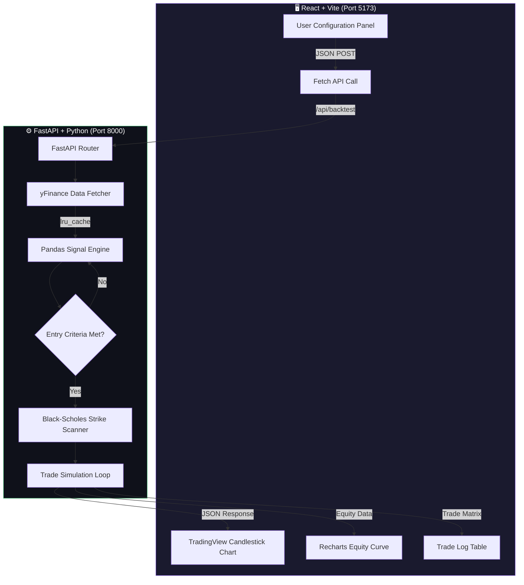

<div align="center">

# 📈 SPY Options Backtesting Engine

### *Institutional-Grade Algorithmic Trading Simulator*

A full-stack platform for backtesting **Bull Call Spread** strategies on SPY ETF options using the Black-Scholes mathematical pricing model, real historical market data, and interactive TradingView charting.

[](https://www.python.org/)
[](https://fastapi.tiangolo.com)
[](https://scipy.org/)
[](https://reactjs.org/)
[](https://tradingview.github.io/lightweight-charts/)
[]()

</div>

---

## 📋 Table of Contents

- [Architecture Overview](#-architecture-overview)
- [Project Structure](#-project-structure)
- [How It Works — The Full Pipeline](#-how-it-works--the-full-pipeline)
- [Configuration Variables Reference](#-configuration-variables-reference)
- [Signal Filters — Deep Dive](#-signal-filters--deep-dive)
- [Black-Scholes Options Pricing Engine](#-black-scholes-options-pricing-engine)
- [API Reference](#-api-reference)
- [Frontend Dashboard](#-frontend-dashboard)
- [Getting Started](#-getting-started)
- [Known Limitations](#-known-limitations)
- [Suggestions & Improvements](#-suggestions--improvements)
- [Roadmap & TODO](#-roadmap--todo)

---

## 🏗️ Architecture Overview

The platform is a **decoupled two-tier system** where the Python math engine and the React visual layer communicate over a local REST API.



### Data Flow Summary

1. **User** tweaks parameters in the sidebar (red days, DTE, filters, stop loss)
2. **React** sends a `POST` to `http://127.0.0.1:8000/api/backtest` with the full config
3. **FastAPI** fetches SPY OHLC data from Yahoo Finance (cached via `lru_cache`)
4. **Pandas** computes technical indicators (RSI, EMA, SMA, Volume MA, Historical Volatility)
5. **Signal Engine** scans day-by-day for consecutive red-day patterns that pass all enabled filters
6. **Black-Scholes** prices the Bull Call Spread at entry (and re-prices daily for exit valuation)
7. **Trade Loop** tracks position until exit condition (green days / stop loss / expiration)
8. **JSON Response** returns `metrics`, `trades`, `equity_curve`, and `price_history` arrays
9. **TradingView** renders candlesticks with trade markers; Recharts draws the equity curve

---

## 📁 Project Structure

```
trading_bot/
├── main.py                    # FastAPI backend — the entire math engine
├── requirements.txt           # Python dependencies
├── .env.example               # Template for future API keys (Tradier)
├── pine_script_example.pine   # Reference PineScript for TradingView alerts
├── README.md                  # This file
│
└── frontend/                  # React + Vite application
    ├── package.json
    ├── vite.config.js
    └── src/
        ├── main.jsx           # React entry point (includes ErrorBoundary)
        └── App.jsx            # Main dashboard component
```

---

## 🧠 How It Works — The Full Pipeline

### Phase 1: Data Acquisition

```python
@lru_cache(maxsize=10)
def fetch_historical_data(ticker: str, period: str):
    df = yf.download(ticker, period=period, progress=False)
```

- **Source**: Yahoo Finance via `yfinance` library
- **Caching**: The `lru_cache` decorator memoizes the last 10 unique ticker/period combinations. This means you can click "Run Simulation" hundreds of times while tweaking parameters — **only the first call hits Yahoo's servers**. Subsequent calls return the cached DataFrame instantly.
- **Data Cleaning**: Multi-index columns are flattened, timezone info is stripped, and the index is reset to a clean `Date` column.

### Phase 2: Technical Indicator Computation

Once the raw OHLC data is obtained, Pandas vectorized operations compute all indicators in a single pass:

| Indicator | Column Name | Calculation | Purpose |
|---|---|---|---|
| Green Day Flag | `is_green` | `Close > Open` | Identifies bullish candles |
| Red Day Flag | `is_red` | `Close < Open` | Identifies bearish candles |
| Consecutive Green Count | `greenDays` | Cumulative streak counter | Exit signal trigger |
| Consecutive Red Count | `redDays` | Cumulative streak counter | Entry signal trigger |
| EMA (N-period) | `EMA_N` | `ewm(span=N).mean()` | Trend-following pullback filter |
| SMA (200-period) | `SMA_200` | `rolling(200).mean()` | Macro bull/bear market filter |
| Volume Moving Average | `Volume_MA` | `rolling(10).mean()` | Volume spike detection baseline |
| Historical Volatility | `HV_21` | 21-day rolling std × √252 | Annualized IV proxy for Black-Scholes |
| RSI (14-period) | `RSI` | Wilder's smoothing method | Momentum oversold filter |

### Phase 3: Signal Generation (Entry Engine)

The entry engine runs a **day-by-day loop** through the entire DataFrame. On each bar, it checks:

```
IF consecutive_red_days == entry_red_days (or entry_red_days + 1):
    IF RSI filter enabled → RSI must be < threshold (oversold)
    IF EMA filter enabled → Close must be < EMA_N (pulled back below trend)
    IF SMA filter enabled → Close must be > SMA_200 (still in bull market)
    IF Volume filter enabled → Volume must be > Volume_MA (capitulation spike)
    
    IF all active filters pass → ENTER TRADE
```

> **Why `entry_red_days + 1`?** This provides a one-day tolerance window. If the user sets 2 red days, the engine will also accept entries on the 3rd consecutive red day, ensuring it doesn't miss signals that span over a weekend gap.

### Phase 4: Black-Scholes Strike Selection

When entry criteria are met, the engine constructs a **Bull Call Spread** (buy lower strike call, sell higher strike call):

1. **DTE Calculation**: From the entry date, find the nearest Friday that satisfies `target_dte`. The engine loops forward in 7-day increments until the DTE threshold is met.

2. **ATM Strike**: The long call strike (`K1`) is set to `round(SPY_close)` — the nearest dollar strike to the current spot price.

3. **OTM Strike Scanner**: The engine iterates from `K1 + 1` up to `K1 + 40`, pricing each potential short call via Black-Scholes. It selects the strike where `Price(K1) - Price(K_short)` most closely matches the user's `spread_cost_target / 100`.

4. **Entry Cost**: `(long_call_price - short_call_price) × 100 × contracts_per_trade`

### Phase 5: Daily Position Management (Exit Engine)

While in a position, the engine re-prices the spread **every single trading day** using updated inputs:

```
new_DTE = entry_DTE - days_held
T_current = new_DTE / 365.25

current_spread_value = (
    bs_call_price(S_today, K_long, T_current, r, sigma_today)
  - bs_call_price(S_today, K_short, T_current, r, sigma_today)
) × 100 × contracts
```

**Exit triggers** (first one to fire wins):

| Trigger | Condition | Badge in UI |
|---|---|---|
| 🟢 Profit Target | `consecutive_green_days == exit_green_days` | `GREEN DAYS` |
| 🔴 Stop Loss | `current_value ≤ entry_cost × (1 - stop_loss_pct/100)` | `STOP LOSS` |
| ⚪ Expiration | `new_DTE == 0` (reached expiration Friday) | `EXPIRED (0 DTE)` |

---

## ⚙️ Configuration Variables Reference

### Core Strategy Parameters

| Variable | Type | Default | Description |
|---|---|---|---|
| `ticker` | `str` | `"SPY"` | The underlying ETF to backtest. Can be changed to `QQQ`, `IWM`, etc. |
| `years_history` | `int` | `2` | Number of years of historical data to fetch from Yahoo Finance. |
| `capital_allocation` | `float` | `$10,000` | Starting portfolio capital. All P&L is tracked against this baseline. |
| `contracts_per_trade` | `int` | `1` | Number of option contracts per spread (1 contract = 100 shares notional). |
| `spread_cost_target` | `float` | `$250` | The desired debit cost per spread. The engine finds strikes to match this. |
| `entry_red_days` | `int` | `2` | Consecutive red (bearish) candles required before the bot considers entering. |
| `exit_green_days` | `int` | `2` | Consecutive green (bullish) candles required to trigger the profit exit. |
| `target_dte` | `int` | `14` | Minimum days-to-expiration when entering. Options with shorter DTE are skipped. |
| `stop_loss_pct` | `float` | `0` | Premium decay stop loss percentage (0 = disabled). Set to 50 for a 50% max loss. |

### Filter Toggles

| Variable | Type | Default | Description |
|---|---|---|---|
| `use_rsi_filter` | `bool` | `true` | Require RSI to be oversold before entry. |
| `rsi_threshold` | `int` | `30` | RSI must be *below* this value to allow entry. Lower = stricter. |
| `use_ema_filter` | `bool` | `true` | Require price to be *below* the EMA (pullback confirmation). |
| `ema_length` | `int` | `10` | Period for the Exponential Moving Average calculation. |
| `use_sma200_filter` | `bool` | `false` | Only allow entries when price is *above* the 200-day SMA (bull market only). |
| `use_volume_filter` | `bool` | `false` | Only allow entries on days with *above-average* volume (capitulation signal). |

### Internal Constants (Hardcoded in `main.py`)

| Constant | Value | Purpose |
|---|---|---|
| `RISK_FREE_RATE` | `0.045` (4.5%) | Risk-free rate proxy used in Black-Scholes `r` parameter |
| HV Rolling Window | `21 days` | Historical volatility lookback period |
| HV Fallback | `0.15` (15%) | Default IV used for the first 21 trading days before the rolling window has data |
| Strike Scan Range | `K+1` to `K+40` | OTM strike search ceiling for the short leg |
| Volume MA Window | `10 days` | Rolling mean window for volume spike detection |

---

## 🛡️ Signal Filters — Deep Dive

Each filter can be independently toggled on/off from the dashboard sidebar. This lets you A/B test which combinations improve win rate.

### 📊 RSI Filter (Relative Strength Index)

**What it does**: Blocks entries unless the 14-period RSI is below a threshold (default: 30), indicating the asset is mathematically "oversold."

**Why it matters**: Without this filter, the bot will buy every 2-red-day dip — including the middle of a sustained crash where SPY drops 10 days in a row. The RSI filter ensures you're only buying when momentum has been exhausted and a reversal is statistically likely.

**Optimal ranges**: `25–35` for aggressive strategies, `20–25` for conservative (fewer but higher-conviction entries).

### 📈 EMA Pullback Filter

**What it does**: Requires the current price to be *below* the N-period EMA at the moment of entry.

**Why it matters**: This confirms that the red days represent a genuine pullback *within an uptrend*, not a breakdown. If price is above the EMA even after 2 red days, the dip was shallow and the momentum is still bullish — the filter waits for a deeper pullback.

**Optimal ranges**: `8–13` period for swing trading, `20–50` for position trading.

### 🧱 SMA 200 Macro Filter

**What it does**: Only allows entries when SPY is trading *above* the 200-day Simple Moving Average.

**Why it matters**: The 200 SMA is the single most-watched institutional indicator for determining bull vs. bear markets. When enabled, this filter prevents the bot from buying dips during bear markets (2022-style sustained drawdowns) which almost always result in the spread expiring worthless.

**Trade-off**: You will miss some excellent "bottom fishing" entries during the early stages of a recovery.

### 🌊 Volume Spike Filter

**What it does**: Requires the entry day's volume to be higher than the 10-day rolling average.

**Why it matters**: Elevated volume on a red day suggests institutional capitulation or forced liquidation — often a precursor to a short-term reversal. Low-volume red days tend to be controlled sell-offs with further downside ahead.

---

## 📐 Black-Scholes Options Pricing Engine

The heart of the backtester. Instead of approximating option prices with linear models, we use the exact **Black-Scholes European Call** formula from quantitative finance:

### The Formula

```
C(S, K, T, r, σ) = S·N(d₁) − K·e^(−rT)·N(d₂)
```

Where:
```
d₁ = [ln(S/K) + (r + σ²/2)·T] / (σ·√T)
d₂ = d₁ − σ·√T
```

### Variable Definitions

| Symbol | Name | Source |
|---|---|---|
| `S` | Current SPY spot price | `df['Close']` on the given day |
| `K` | Strike price | Computed by the strike scanner |
| `T` | Time to expiration (years) | `DTE / 365.25` — decrements daily while in trade |
| `r` | Risk-free interest rate | `0.045` (hardcoded proxy for US Treasury yield) |
| `σ` | Annualized volatility | `df['HV_21']` — 21-day rolling historical volatility |
| `N(x)` | Cumulative standard normal CDF | `scipy.stats.norm.cdf(x)` |

### How Theta Decay Works in the Engine

Every day you hold a trade, `DTE` decreases by 1. Because `T = DTE / 365.25`, the time value of both legs of the spread erodes. The long ATM call decays faster than the short OTM call in the final days, which means:

- **Early in the trade** (7+ DTE): Theta decay is gradual and manageable
- **Final 3 days** (3–0 DTE): Theta decay accelerates exponentially
- **At expiration** (0 DTE): The formula reduces to `max(0, S − K)` — pure intrinsic value

This is why `target_dte` is so critical. Trading weeklies (2-5 DTE) gives you almost no time for the green-day exit to trigger before Theta eats the premium.

### Spread Valuation Example

```
Entry Day:
  SPY = $450.00, σ = 0.18, DTE = 14, r = 0.045
  Long $450 Call = $6.82
  Short $455 Call = $4.32
  Spread Cost = ($6.82 - $4.32) × 100 = $250.00 ✓

Day 3 (SPY rallies to $453):
  DTE = 11, σ = 0.17
  Long $450 Call = $8.10
  Short $455 Call = $5.15
  Spread Value = ($8.10 - $5.15) × 100 = $295.00
  Unrealized P&L = +$45.00

Day 7 (SPY flat at $451):
  DTE = 7, σ = 0.18
  Long $450 Call = $4.90
  Short $455 Call = $2.80
  Spread Value = ($4.90 - $2.80) × 100 = $210.00
  Unrealized P&L = -$40.00  ← Theta ate the premium!
```

---

## 🔌 API Reference

### `POST /api/backtest`

**Request Body** (JSON):
```json
{
  "ticker": "SPY",
  "years_history": 2,
  "capital_allocation": 10000.0,
  "contracts_per_trade": 1,
  "spread_cost_target": 250.0,
  "entry_red_days": 2,
  "exit_green_days": 2,
  "target_dte": 14,
  "stop_loss_pct": 0,
  "use_rsi_filter": true,
  "rsi_threshold": 30,
  "use_ema_filter": true,
  "ema_length": 10,
  "use_sma200_filter": false,
  "use_volume_filter": false
}
```

**Response Body** (JSON):
```json
{
  "metrics": {
    "total_trades": 24,
    "win_rate": 66.67,
    "total_pnl": 1250.40,
    "final_equity": 11250.40
  },
  "trades": [
    {
      "entry_date": "2024-03-15",
      "exit_date": "2024-03-18",
      "entry_spy": 510.0,
      "exit_spy": 514.23,
      "spread_cost": 248.50,
      "spread_exit": 312.80,
      "pnl": 64.30,
      "win": true,
      "stopped_out": false,
      "expired": false
    }
  ],
  "equity_curve": [
    { "date": "2022-04-08", "equity": 10000.0 },
    { "date": "2022-04-11", "equity": 10064.30 }
  ],
  "price_history": [
    { "time": "2022-04-08", "open": 449.31, "high": 451.72, "low": 447.80, "close": 450.50 }
  ]
}
```

---

## 🖥️ Frontend Dashboard

The React frontend is a single-page application built with **Vite**.

### Visual Components

| Component | Library | Purpose |
|---|---|---|
| Candlestick Chart | `lightweight-charts` v5.1 | Full OHLC price action with Buy/Sell arrow markers |
| Equity Curve | `recharts` | Smooth gradient area chart showing portfolio growth |
| Metrics Grid | React | 4 cards showing P&L, Win Rate, Total Trades, Final Capital |
| Trade Log | HTML Table | Scrollable log of every trade with exit condition badges |
| Config Sidebar | React State | All parameters as interactive inputs with filter toggles |

### TradingView Markers

When the backtest completes, the frontend maps every trade to a visual marker on the candlestick chart:

| Marker | Color | Shape | Meaning |
|---|---|---|---|
| **Buy** | 🟢 Green | Arrow Up (below candle) | Entry signal fired |
| **Sell (Win)** | 🟢 Green | Arrow Down (above candle) | Profitable exit via green days |
| **Sell (Loss)** | 🔴 Red | Arrow Down (above candle) | Unprofitable exit via green days |
| **Stopped** | 🔴 Red | Arrow Down (above candle) | Stop loss triggered |
| **Expired** | ⚪ Gray | Arrow Down (above candle) | Option reached 0 DTE |

### Error Boundary

The app includes a **React Error Boundary** wrapper in `main.jsx`. If any runtime crash occurs (e.g., a charting library error), instead of a blank white screen, the user sees a red error message with the exact exception text.

---

## 🚀 Getting Started

### Prerequisites

- **Python 3.11+** installed
- **Node.js 18+** and **npm** installed
- Internet connection (for Yahoo Finance data on first fetch)

### Installation

```bash
# Clone / navigate to the project
cd trading_bot

# Install Python dependencies
pip install -r requirements.txt

# Install Frontend dependencies
cd frontend
npm install
cd ..
```

### Running the Application

> ⚠️ **You need TWO separate terminals running simultaneously.**

**Terminal 1 — Python Backend (Port 8000)**
```bash
cd trading_bot
python -m uvicorn main:app --host 127.0.0.1 --port 8000 --reload
```

**Terminal 2 — React Frontend (Port 5173)**
```bash
cd trading_bot/frontend
npm run dev
```

**Open your browser** → Navigate to `http://localhost:5173`

### Quick Start Config (Recommended First Run)

| Parameter | Value | Why |
|---|---|---|
| Ticker | `SPY` | Most liquid ETF with tightest option spreads |
| History | `2` years | Enough data for statistical significance |
| Entry Red Days | `2` | Standard pullback depth |
| Exit Green Days | `1` | Best for weeklies — grab the first bounce |
| Target DTE | `7` | One-week expiration cycles |
| Spread Cost | `$250` | Moderate risk per trade |
| Stop Loss | `50%` | Prevent full wipeout on crash days |
| RSI Filter | ✅ On, threshold `30` | Block entries unless truly oversold |
| EMA Filter | ✅ On, length `10` | Confirm pullback within uptrend |

---

## ⚠️ Known Limitations

| Limitation | Impact | Potential Fix |
|---|---|---|
| **European-style pricing** | Black-Scholes models European options; SPY options are American-style with early exercise rights | Implement Binomial Tree or Barone-Adesi-Whaley approximation |
| **No bid-ask spread modeling** | Entries/exits assume mid-price fills; real fills include slippage | Add configurable spread (e.g., $0.05–$0.15 per leg) |
| **Static risk-free rate** | Hardcoded at 4.5%; actual Treasury yields fluctuate | Pull live yields from FRED API |
| **No dividend modeling** | SPY pays quarterly dividends that affect call pricing | Integrate dividend yield into BS formula |
| **Historical volatility only** | Uses 21-day HV as IV proxy; real IV can diverge significantly | Source historical IV data from CBOE or OptionMetrics |
| **No intraday simulation** | All signals evaluated on daily close; real entries might happen intraday | Integrate 15-min or 5-min candle data |
| **Yahoo Finance rate limits** | ~2,000 requests/hour per IP | Already mitigated with `lru_cache` |

---

## 💡 Suggestions & Improvements

### High-Impact Enhancements

1. **Monte Carlo Simulation**: Run 1,000+ randomized permutations of the strategy to generate a statistical distribution of outcomes, rather than a single historical equity curve. This reveals the true expected value and worst-case drawdowns.

2. **Walk-Forward Optimization**: Instead of backtesting the same parameters on the same historical window, split the data into rolling train/test windows. Optimize parameters on the first 6 months, test on the next 3. This prevents overfitting.

3. **Greeks Dashboard Panel**: Display live Delta (Δ), Theta (Θ), Gamma (Γ), and Vega (ν) for each active position. These are already computed implicitly by the BS engine — just expose them in the UI.

4. **Multi-Ticker Comparison**: Allow running the same strategy across SPY, QQQ, IWM, and DIA simultaneously, then display comparative equity curves on a single chart.

5. **Sharpe Ratio & Max Drawdown Metrics**: Add institutional risk metrics beyond simple win rate: Sharpe ratio, Sortino ratio, max drawdown percentage, average win/loss ratio, and profit factor.

### Medium-Impact Enhancements

6. **Bid-Ask Spread Simulator**: Add a configurable slippage parameter (e.g., $0.05 per leg) that penalizes every entry and exit. This gives a much more realistic P&L.

7. **Position Sizing (Kelly Criterion)**: Instead of a fixed spread cost, dynamically size each trade based on the Kelly formula using the strategy's historical win rate and payoff ratio.

8. **Export to CSV / PDF**: Allow users to download the trade log and equity curve as a formatted report for record-keeping or tax purposes.

9. **localStorage Persistence**: Save the user's last-used configuration parameters in the browser so they persist across page refreshes.

10. **Dark/Light Theme Toggle**: Add a light mode option for daytime use alongside the existing dark theme.

### Backend Improvements

11. **Async Data Fetching**: Replace `yfinance` synchronous calls with an async-compatible library or run in a thread pool to prevent blocking the event loop.

12. **Database Integration (SQLite/PostgreSQL)**: Store historical backtest results so users can compare past runs without re-simulating.

13. **WebSocket Live Feed**: Push live SPY price updates to the frontend via WebSocket for eventual real-time signal monitoring.

14. **Unit Tests**: Add pytest coverage for the Black-Scholes function, strike selection logic, and signal generation to prevent regressions.

---

## 📌 Roadmap & TODO

### Phase 4: Live Execution Engine 🔴 *Not Started*
- [ ] Integrate **Tradier Brokerage API** for real-time options chain data
- [ ] Replace synthetic BS pricing with live bid/ask quotes from Tradier
- [ ] Build a `/webhook` endpoint that accepts TradingView alerts via POST
- [ ] Implement order placement logic (buy-to-open spread, sell-to-close spread)
- [ ] Add paper trading mode before going live with real capital
- [ ] Build WebSocket connection for real-time position monitoring

### Phase 5: Advanced Analytics 🟡 *Planned*
- [ ] Add Sharpe Ratio, Sortino Ratio, and Max Drawdown to the metrics grid
- [ ] Implement Monte Carlo simulation (1,000+ iterations)
- [ ] Build a heatmap showing win rate by day-of-week and month
- [ ] Add average holding period and average P&L per trade metrics
- [ ] Create a drawdown chart (separate from equity curve)

### Phase 6: UI/UX Polish 🟡 *Planned*
- [ ] Add `localStorage` persistence for config parameters
- [ ] Implement loading skeleton animations during simulation
- [ ] Add tooltip explanations for each configuration field
- [ ] Build a "Preset Strategies" dropdown (Conservative, Aggressive, Weekly Scalp)
- [ ] Add keyboard shortcuts (Enter to run simulation, Escape to reset)
- [ ] Mobile-responsive sidebar collapse

### Phase 7: Infrastructure 🟡 *Planned*
- [ ] Dockerize the full stack (Python + React) with `docker-compose`
- [ ] Deploy to cloud provider (AWS EC2 / DigitalOcean / Railway)
- [ ] Add CI/CD pipeline for automated testing on push
- [ ] Set up environment variable management for production secrets
- [ ] Add rate limiting and authentication to the API

### Phase 8: Data & Research 🔵 *Future*
- [ ] Source real historical implied volatility data (CBOE VIX term structure)
- [ ] Add support for Put Credit Spreads (bearish strategy variant)
- [ ] Implement Iron Condor backtesting (neutral strategy)
- [ ] Multi-timeframe analysis (weekly + daily signals)
- [ ] Integrate FRED API for dynamic risk-free rate
- [ ] Add earnings date awareness (block entries around SPY rebalance dates)

---

## 🧰 Tech Stack Summary

| Layer | Technology | Version | Purpose |
|---|---|---|---|
| **Runtime** | Python | 3.11+ | Backend execution environment |
| **Web Framework** | FastAPI | Latest | Async REST API with auto-docs at `/docs` |
| **ASGI Server** | Uvicorn | Latest | High-performance Python server |
| **Data Source** | yfinance | Latest | Yahoo Finance historical OHLC data |
| **Math Engine** | SciPy | Latest | `scipy.stats.norm.cdf` for Black-Scholes |
| **Data Processing** | Pandas + NumPy | Latest | Vectorized indicator computation |
| **Frontend Runtime** | React | 18+ | Component-based UI |
| **Build Tool** | Vite | 8.x | Sub-second HMR dev server |
| **Charting (OHLC)** | lightweight-charts | 5.1 | TradingView open-source candlestick engine |
| **Charting (Equity)** | Recharts | Latest | React-native SVG area charts |

---

<div align="center">
  <sub>Built with ❤️ for algorithmic options traders. Not financial advice.</sub>
</div>
