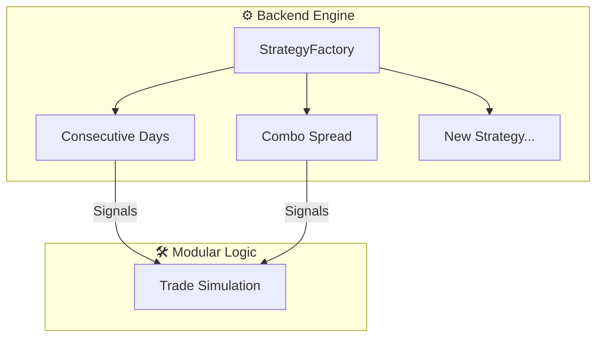

<div align="center">

# 📈 SPY Options Backtesting Engine

### *Institutional-Grade Algorithmic Trading & Research Platform*

A high-performance full-stack platform for backtesting, optimizing, and live-scanning options strategies. Supports modular plugins, advanced risk analytics (Monte Carlo, Kelly Criterion), and integrated Alpaca paper trading.

[](https://www.python.org/)
[](https://fastapi.tiangolo.com)
[](https://scipy.org/)
[](https://reactjs.org/)
[](https://tradingview.github.io/lightweight-charts/)
[]()

</div>

---

## 📋 Table of Contents

- [Modular Architecture](#-modular-architecture)
- [Integrated Strategies](#-integrated-strategies)
- [Advanced Analytics Suite](#-advanced-analytics-suite)
- [Live Paper Trading (Alpaca)](#-live-paper-trading-alpaca)
- [Configuration Reference](#-configuration-reference)
- [Black-Scholes Pricing Engine](#-black-scholes-pricing-engine)
- [Installation & Setup](#-installation--setup)

---

## 🏗️ Modular Architecture

The platform now features a **Modular Strategy Plugin** system. Logic for individual strategies is decoupled from the core backtesting engine, allowing for rapid development of new trading models.

### Strategy Plugin Structure
- **`strategies/base.py`**: Abstract base class defining the required interface (`compute_indicators`, `check_entry`, `check_exit`).
- **`strategies/consecutive_days.py`**: The classic Red/Green day reversal logic.
- **`strategies/combo_spread.py`**: Advanced logic based on SMA/EMA crosses and volume breakouts.



---

## 🛠️ Integrated Strategies

### 1. Consecutive Days (Mean Reversion)
- **Entry**: Fires after $N$ consecutive red (for Bull Call) or green (for Bear Put) candles.
- **Exit**: Triggered by a reversal of $M$ candles in the opposite direction or stop loss.
- **Filters**: RSI oversold/overbought, EMA trend-following, SMA 200 bull/bear filter.

### 2. Combo Spread (Trend/Volume Breakout)
- **Indicators**: SMA(3, 8, 10), EMA(5, 3), and OHLC Average.
- **Entry 01**: SMA crossdown logic combined with EMA trend alignment.
- **Entry 02**: Low-volume EMA breakout with OHLC average confirmation.
- **Exit**: Time-based (Max Bars) or Profit-count based (N profitable closes).

---

## 📊 Advanced Analytics Suite

Transforming backtests into actionable risk models.

- **Monte Carlo Simulation**: Generates 1,000 randomized permutations of trade histories to calculate **Probability of Profit** and statistically expected outcomes.
- **Kelly Criterion**: Automatically computes the **Optimal Position Size** (`f*`) based on historical win rates and payoff ratios.
- **Walk-Forward Analysis**: Splits historical data into rolling windows to verify strategy stability across different market cycles.
- **Regime Breakdown**: Categorizes every trade into **Bull**, **Bear**, or **Sideways** regimes to identify where the strategy underperforms.
- **Heatmaps**: Visualizes win rates by Day-of-Week and Month to spot seasonal patterns.

---

## 🔴 Live Paper Trading (Alpaca)

Turn your research into execution directly from the dashboard.

- **Alpaca API Integration**: Connect your paper account via API Key and Secret.
- **Signal Scanner**: Real-time evaluation of market the selected strategy logic using live data.
- **Auto-Scanning**: Configurable polling (e.g., every 60s) to monitor for entry signals.
- **Auto-Execution**: Optional toggle to automatically place market orders on Alpaca when a signal fires.
- **Live Monitoring**: View open positions, unrealized P&L, and recent order history in the sidebar.

---

## 📐 Black-Scholes Options Pricing Engine

We use the exact **Black-Scholes European Call/Put** formulas for synthetic option pricing during backtests:

```
C(S, K, T, r, σ) = S·N(d₁) − K·e^(−rT)·N(d₂)
```

- **S**: Current spot price (yf close)
- **K**: Strike price (Atm/Otm via scanner)
- **T**: Time to expiration (years)
- **r**: Risk-free rate (4.5% hardcoded)
- **σ**: Annualized volatility (21-day rolling HV)

---

## 🚀 Installation & Setup

### 1. Requirements
- Python 3.11+
- Node.js 18+

### 2. Installation
```bash
# Clone the repository
git clone https://github.com/gsl0001/spy_credit_spread.git
cd spy_credit_spread

# Setup Python environment
pip install -r requirements.txt

# Setup Frontend
cd frontend
npm install
```

### 3. Execution
**Terminal 1 (Backend)**:
```bash
python -m uvicorn main:app --reload
```

**Terminal 2 (Frontend)**:
```bash
cd frontend
npm run dev
```

---

<div align="center">
  <sub>Built for data-driven options traders. <b>Not financial advice.</b></sub>
</div>
