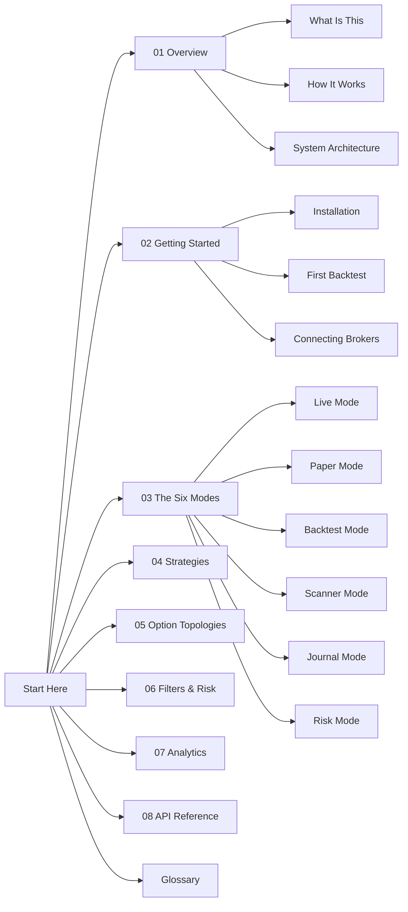

# Welcome to the SPY Options Trading Engine

> [!info] What is this vault?
> This is a friendly, visual tour of the **SPY Options Backtesting & Trading Platform**. Read it in any order — every page has links to the next idea.

The platform lets you **research**, **simulate**, and **trade** options strategies on SPY (or any ticker yfinance supports). It bundles six tools into one dashboard so you can move from "what if?" to "place the order" without leaving the app.

---

## Pick your path

> [!tip] New to the project?
> Start with [[What Is This]] then read [[How It Works]].

> [!tip] Want to install and run it?
> Jump to [[Installation]] then [[First Backtest]].

> [!tip] Ready to trade?
> Read [[Connecting Brokers]], then [[Paper Mode]] before [[Live Mode]].

> [!tip] Curious about the math?
> See [[Strategy Overview]], [[Topology Overview]], and [[Metrics Explained]].

---

## Vault map

---

## Quick reference

| You want to... | Open this note |
|----------------|----------------|
| Understand the big picture | [[What Is This]] · [[How It Works]] |
| See the file & module layout | [[System Architecture]] |
| Install everything | [[Installation]] |
| Run your first simulation | [[First Backtest]] |
| Trade with fake money | [[Paper Mode]] |
| Trade with real money | [[Live Mode]] |
| Auto-scan for signals | [[Scanner Mode]] |
| Audit past trades | [[Journal Mode]] |
| Block bad trades before they fire | [[Risk Mode]] |
| Pick a strategy | [[Strategy Overview]] |
| Pick an option structure | [[Topology Overview]] |
| Tune entry filters | [[Entry Filters]] |
| Read performance numbers | [[Metrics Explained]] |
| Use the REST API | [[REST Endpoints]] |
| Look up an unfamiliar word | [[Glossary]] |

---

> [!warning] Not financial advice
> This platform is a research and execution tool. Markets are risky. Test in [[Paper Mode]] before you ever touch [[Live Mode]].
