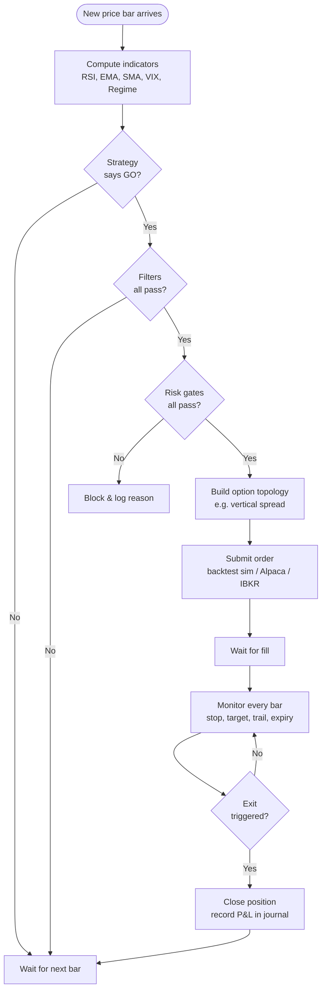
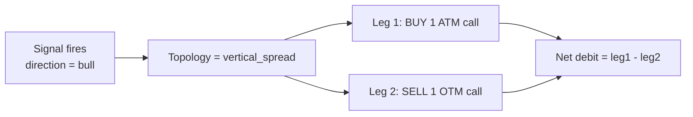
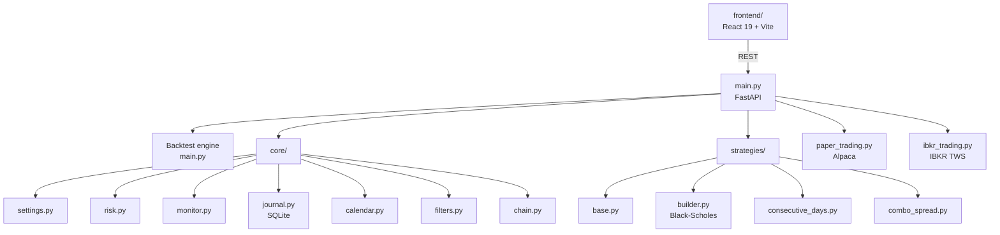

# How It Works

> [!abstract] The mental model
> A **strategy** decides *when* to trade. A **topology** decides *what* option structure to trade. **Filters** veto bad setups. **Risk checks** veto bad orders. The chosen path is the same in backtest, paper, and live.

## The trading flow

## The four moving parts

> [!info] These four pieces are independent
> Swap any one of them without touching the others.

### 1. Strategy — the *signal*

A class that answers two questions on every bar:
- `check_entry(...)` → should we open a trade?
- `check_exit(...)` → should we close it?

Built in: [[Consecutive Days]], [[Combo Spread]]. Add your own → [[Building Your Own]].

### 2. Topology — the *structure*

Once a signal fires, the **topology builder** picks strikes and prices the legs using Black-Scholes.

See [[Topology Overview]] for the full menu.

### 3. Filters — the *vetoes*

Before placing the trade, optional filters check market conditions:

- **RSI** — is it actually oversold/overbought?
- **EMA / SMA200** — is price aligned with trend?
- **Volume** — is there real participation?
- **VIX band** — is volatility in our comfort zone?
- **Regime** — is the broader market bullish/bearish/sideways as required?

See [[Entry Filters]].

### 4. Risk gates — the *firewall*

Even if everything else passes, the risk module can still kill the order. It checks:

- Market is currently open
- We aren't past the daily loss limit
- We don't already hold the max number of concurrent positions
- Today isn't a blackout day (FOMC, CPI, NFP)
- Buying power is sufficient

See [[Risk Mode]].

## Where each piece lives in code

## The promise of *parity*

> [!success] Backtest = Scanner = Live
> The exact same `core/filters.py` runs in:
> 1. The historical [[Backtest Mode]] loop
> 2. The live [[Scanner Mode]] cron job
> 3. The [[Paper Mode]] and [[Live Mode]] auto-execute paths
>
> If your backtest says "go," the scanner would have said "go" too — assuming identical conditions.

---

Next: [[System Architecture]] · [[Installation]]
