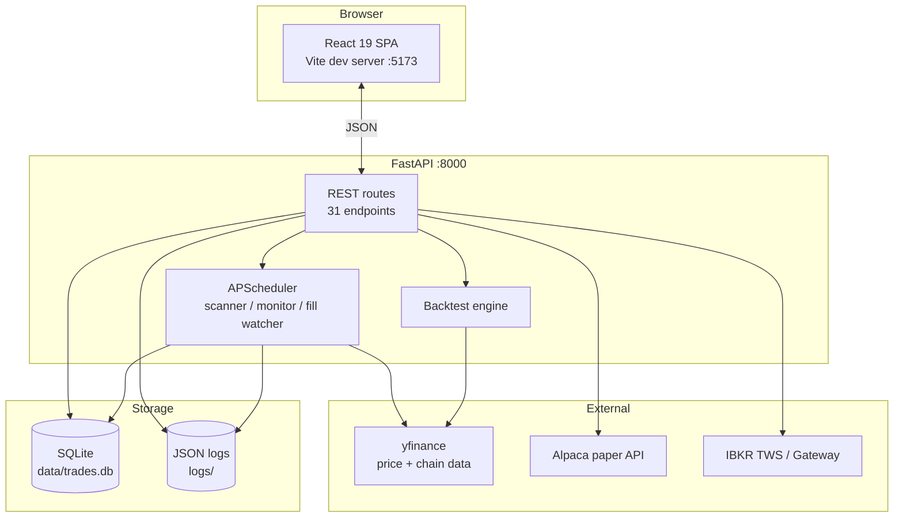
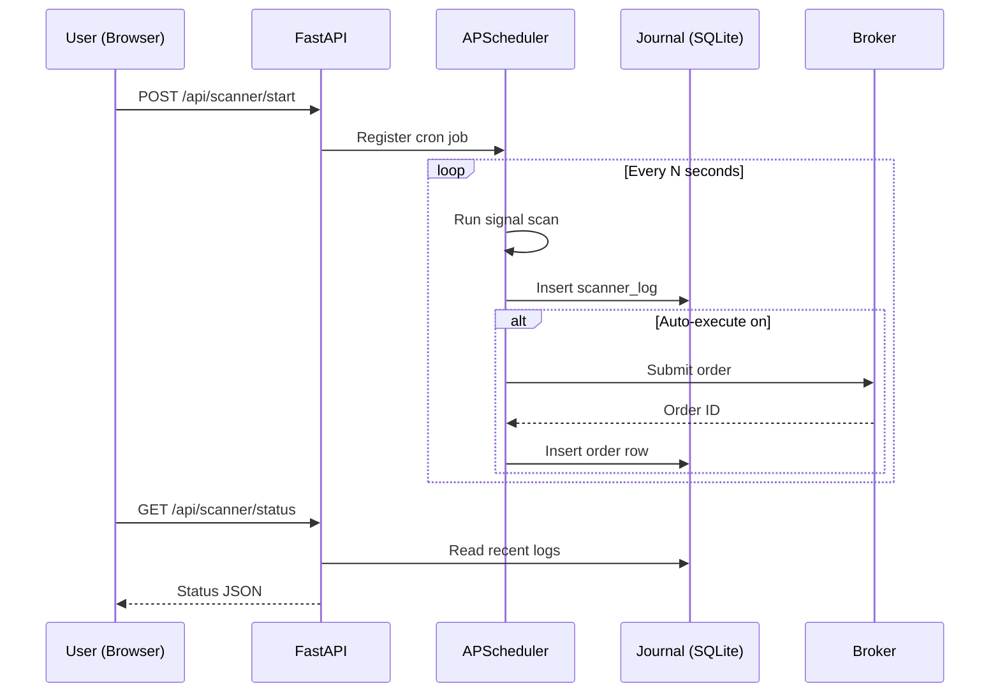

# System Architecture

> [!abstract] At a glance
> A FastAPI backend (`main.py`) serves a React 19 frontend. Background jobs (scanner, monitor, fill watcher) run on APScheduler. State persists in SQLite (`core/journal.py`). Brokers are reached via `ib_insync` (IBKR) and `alpaca-trade-api` (Alpaca).

## High-level diagram



## Folder layout

```
spy_credit_spread/
├── main.py              # FastAPI app — 31 REST routes, the backtest engine
├── start.py             # One-command launcher (backend + frontend)
├── paper_trading.py     # Alpaca client wrapper
├── ibkr_trading.py      # IBKR TWS client wrapper
├── requirements.txt
│
├── core/                # Production runtime modules
│   ├── settings.py      # .env loader, frozen Settings dataclass
│   ├── logger.py        # Structured JSON logging, daily rotation
│   ├── risk.py          # Pre-trade checks: hours, loss cap, concurrent cap
│   ├── monitor.py       # Heartbeat tick loop + alert generation
│   ├── calendar.py      # Holidays + FOMC / CPI / NFP blackout
│   ├── filters.py       # Entry filters (shared by backtest + scanner)
│   ├── fill_watcher.py  # Order fill state machine
│   ├── leader.py        # Single-leader election via fcntl flock
│   ├── chain.py         # Live IBKR option-chain resolver
│   ├── presets.py       # Built-in strategy presets
│   ├── notifier.py      # Webhook / digest delivery
│   ├── scanner.py       # Scanner job runner
│   └── journal.py       # SQLite schema: positions, orders, fills, scanner_logs
│
├── strategies/
│   ├── base.py             # BaseStrategy ABC
│   ├── builder.py          # Black-Scholes pricer + topology builder
│   ├── consecutive_days.py # Mean-reversion strategy
│   └── combo_spread.py     # Trend / volume breakout strategy
│
├── config/
│   ├── .env.example
│   └── events_2026.json    # FOMC / CPI / NFP blackout calendar
│
├── tests/                  # 274 passing tests across 19 files
└── frontend/
    └── src/
        ├── App.jsx
        ├── api.js          # 27 typed API methods
        ├── useBackendData.jsx  # Polling hook
        ├── primitives.jsx  # Card, Btn, Pill, Kpi, Chip, Badge, Heartbeat
        ├── chart.jsx
        ├── topbar.jsx
        ├── sidebar.jsx
        ├── views/          # 6 sidebar views, one per mode
        └── index.css       # Dark theme design system
```

## Process model



## Polling cadences

| What | How often |
|------|-----------|
| Heartbeat (live mode) | every **5 s** |
| Scanner widget | every **3 s** |
| Positions + orders | every **10 s** (auto), **30 s** (full refresh) |
| IBKR heartbeat | every **15 s** |
| Default scanner cadence | every **60 s** |
| Monitor tick (open positions) | every **15 s** |

## Where data lives

| Type | Where |
|------|-------|
| Open & closed positions | `data/trades.db` (SQLite, table: `positions`) |
| Order submissions | `data/trades.db` (table: `orders`) |
| Fill events | `data/trades.db` (table: `fills`) |
| Scanner output | `data/trades.db` (table: `scanner_logs`) |
| Audit events | `data/trades.db` (table: `events`) |
| Strategy + filter config | Browser `localStorage` |
| Custom presets | Browser `localStorage` |
| Daily JSON logs | `logs/` |
| Broker credentials | `.env` (gitignored) or request body |

## Key design choices

> [!info] Why these choices?

**FastAPI over Flask** — automatic OpenAPI docs, async I/O for broker calls, Pydantic validation.

**APScheduler over Celery** — single-process scheduling, no Redis dependency. The `core/leader.py` flock prevents two instances from double-firing scans.

**SQLite over Postgres** — zero-ops, fits in a file, atomic writes are fine for a single-trader workload.

**React + lightweight-charts** — TradingView-quality candlesticks at zero cost.

**yfinance for backtests** — free, daily bars, good enough for end-of-day strategies.

**Black-Scholes for option pricing in backtests** — closed-form, fast, deterministic. Live pricing uses bid/ask from the broker.

---

Next: [[Installation]] · [[The Six Modes|Live Mode]]
