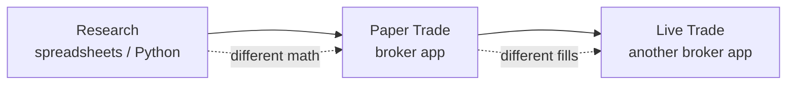
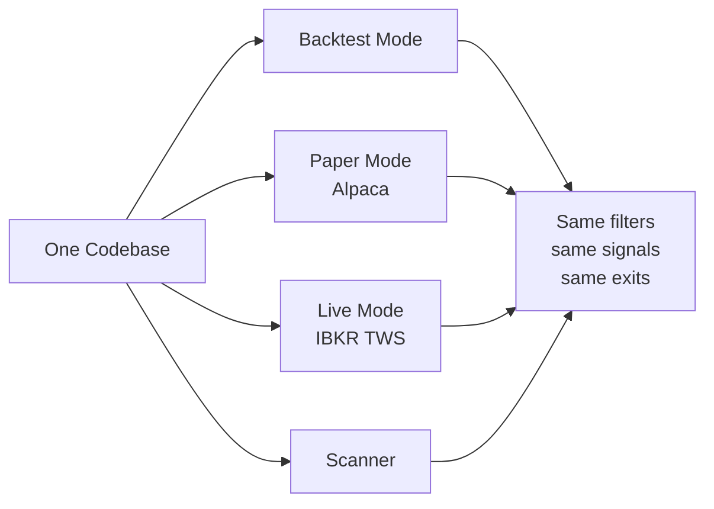

# What Is This?

> [!abstract] In one sentence
> A full-stack platform that lets you **design**, **test**, and **execute** options trades on SPY — all from a single dashboard.

## The problem it solves

Most traders juggle three different tools:

That gap between research and execution is where strategies break. A backtest looks great, paper trading is decent, then live results disappoint. Why? Because the **rules differ subtly** between each tool.

## How this platform fixes it

Every mode runs the **same strategy logic and same entry filters**. If the backtest fires a signal on Tuesday, the live scanner would fire that same signal on a future Tuesday with matching conditions.

## What you get

> [!success] Six tools in one app
> 1. **[[Backtest Mode]]** — simulate a strategy across years of history
> 2. **[[Paper Mode]]** — trade fake money via Alpaca
> 3. **[[Live Mode]]** — trade real money via Interactive Brokers
> 4. **[[Scanner Mode]]** — auto-scan the market on a schedule
> 5. **[[Journal Mode]]** — audit every order, fill, and P&L
> 6. **[[Risk Mode]]** — pre-trade checks that block bad orders

## Who it's for

| You are... | This platform helps you... |
|------------|---------------------------|
| A discretionary options trader | Quantify your gut feel before you risk capital |
| A quant researcher | Move from notebook to live execution without rewriting |
| A systems builder | Inspect a clean FastAPI + React reference architecture |
| Curious about options | Learn by running real simulations and reading the journal |

## What it isn't

> [!warning] Honest limits
> - **Not a magic profit machine.** It executes *your* rules. Bad rules → bad results.
> - **Not a multi-broker abstraction.** It speaks Alpaca and IBKR specifically.
> - **Not a tick-by-tick simulator.** Backtests run on daily bars from yfinance.
> - **Not financial advice.** You are responsible for every order.

---

Next: [[How It Works]] · [[System Architecture]]
