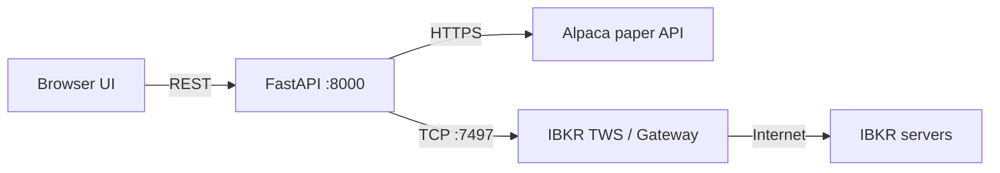
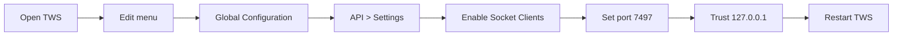
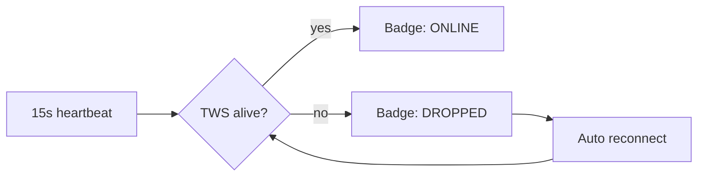

# Connecting Brokers

> [!abstract] Two brokers, two purposes
> **Alpaca** — free paper account, used to validate signals end-to-end with mock fills (equity surrogate, no real options).
> **IBKR TWS** — real options trading, multi-leg combo orders, real money.

## Connection map

---

## Connecting Alpaca (paper)

### 1. Create a free account

Go to [alpaca.markets](https://alpaca.markets) and sign up for a paper account.

### 2. Get API keys

In the dashboard, generate an **API Key** and **Secret**. Treat them like passwords.

### 3. Enter them in the UI

Open **Paper** mode → paste key + secret → click **Connect**.

> [!info] Where credentials live
> They are stored in browser `localStorage` (your machine only) and forwarded to the backend per-request. They are *not* logged.

### 4. Verify

The header HUD updates to show **equity / buying power / cash**. Positions and orders tabs populate every 30 s.

### What works in Paper Mode

| Feature | Status |
|---------|--------|
| Auto-execute on signal | Yes, equity surrogate (buy SPY shares) |
| Multi-leg options | Not yet wired (Alpaca supports it, see Known Issues) |
| Kill switch | Yes — closes all positions immediately |
| Live signal scan | Yes — same logic as backtest |

> [!warning] Currently equity surrogate
> Paper mode places SPY *equity* orders as a stand-in for option fills. For real options simulation use IBKR paper TWS (port 7497).

---

## Connecting IBKR TWS

### 1. Install TWS or IB Gateway

Download from [interactivebrokers.com](https://www.interactivebrokers.com). Either app works — IB Gateway is lighter; TWS has the full charting UI.

### 2. Enable the API

In TWS:

1. **Edit → Global Configuration → API → Settings**
2. Check **Enable ActiveX and Socket Clients**
3. Set **Socket port** to one of:

| Mode | Port |
|------|------|
| Paper TWS | **7497** |
| Live TWS | **7496** |
| Paper IB Gateway | **4002** |
| Live IB Gateway | **4001** |

4. Add `127.0.0.1` to **Trusted IPs**.
5. (Optional) Uncheck "Read-Only API" if you want the platform to place orders.
6. Restart TWS.

### 3. Connect from the UI

Open **Live** mode → enter host (`127.0.0.1`), port (`7497` for paper TWS), client ID (`1`) → click **Connect**.

The status badge cycles **OFFLINE → CONNECTING → ONLINE**.

### 4. Send a test order

Click **Test Order**. This places a non-filling SPY limit buy at $1.05 (a price the market will never accept). It proves the wire path works without risking capital.

### 5. Heartbeat

Every 15 s the backend checks TWS is alive. If it drops, the badge turns red and `core/notifier.py` can fire a webhook.

### What works in Live Mode

| Feature | Status |
|---------|--------|
| Connect / disconnect / reconnect | Yes |
| Real-time account HUD | Yes |
| Open positions table | Yes |
| Open orders table + per-order cancel | Yes |
| Test order | Yes |
| Vertical spread combo orders | Yes (MVP) |
| Long call / put / straddle / iron condor / butterfly | Backtest yes, live wiring pending |
| Kill switch (`/api/ibkr/flatten_all`) | Yes |
| Heartbeat + alerts | Yes |

> [!danger] Real money lives here
> Always double-check: am I on the **paper** port (7497) or **live** port (7496)? The wrong port + a fat-finger order = real loss.

---

## Common connection issues

| Symptom | Cause | Fix |
|---------|-------|-----|
| `couldn't connect to TWS` | API not enabled | See step 2 above |
| `client id already in use` | Another script connected with id=1 | Change `IBKR_CLIENT_ID` |
| `server timeout` | Firewall blocking 7497 | Allow loopback connections |
| Alpaca returns 403 | Wrong key / secret | Re-paste from dashboard |
| Alpaca returns 401 | Using live keys on paper URL | Match URL to key environment |

---

Next: [[Live Mode]] · [[Paper Mode]]
