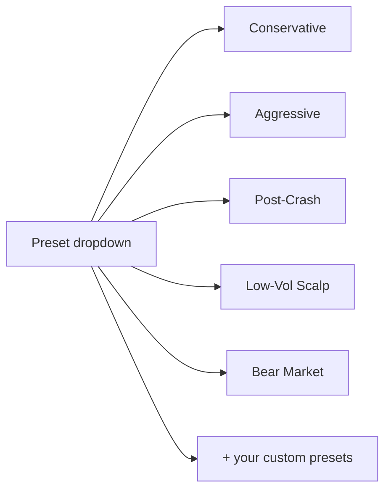
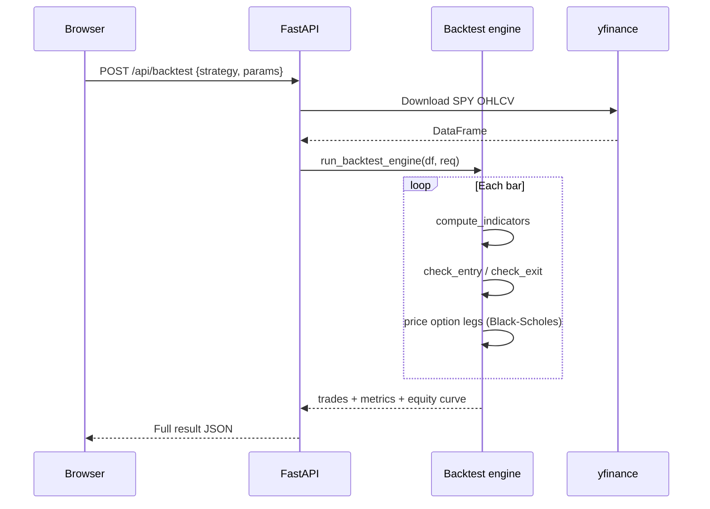
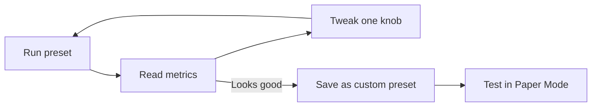

# Your First Backtest

> [!abstract] Goal
> In 5 minutes you'll run a simulation, read the results, and understand what every number means.

## Step 1 — Open the dashboard

After [[Installation]], navigate to `http://localhost:5173`.

Click **Backtest** in the left sidebar.

## Step 2 — Pick a preset

> [!tip] Why presets?
> They're tested combinations of strategy + filters + risk numbers. Start here, modify later.

Pick **Conservative** for your first run.

## Step 3 — Press Run

The backend simulates trades over the historical date range. Typical run takes 2–10 seconds.

## Step 4 — Read the result

You'll see four tabs:

### Chart tab

> [!info] What you're looking at
> Candlesticks of SPY price with **green up-arrows = entries** and **red down-arrows = exits**. The right panel shows your equity curve climbing (or falling) over time.

### Trades tab

A row per trade with: entry/exit dates, SPY prices at each end, spread cost, P&L in dollars and percent, regime label, and the exit reason (`stop`, `target`, `trail`, `expiry`, or strategy-specific).

### Analytics tab

Four sub-views:

| Sub-view | What it tells you |
|----------|-------------------|
| Duration histogram | Are you holding for hours, days, or weeks? |
| **Monte Carlo** | If we resampled trades 1,000 times, what's P5/P50/P95 and the probability of profit? |
| Regime breakdown | Win rate split by **bull / bear / sideways** market |
| Walk-forward | Stability test — does performance hold up on rolling windows? |

### Optimizer tab

Pick two parameters (e.g. `entry_red_days` and `stop_loss_pct`), set a grid, click **Run**. Results sort by P&L. The best row is highlighted.

> [!warning] Don't curve-fit
> A grid winner that shines in-sample often dies out-of-sample. Cross-check with the walk-forward view in Analytics.

## Step 5 — Read the headline metrics

After every run, 14 numbers appear at the top. The ones to watch first:

| Number | What "good" looks like |
|--------|------------------------|
| **Total P&L** | Positive after commissions |
| **Win Rate** | Context-dependent (high WR + low avg win is a trap) |
| **Sharpe** | > 1 is decent, > 2 is rare |
| **Max Drawdown** | The worst peak-to-trough — can you stomach this? |
| **Profit Factor** | > 1.5 is healthy, < 1.0 is a loser |
| **Kelly %** | Suggests a *theoretical* optimal size — usually scale way down |

Full table at [[Metrics Explained]].

## Step 6 — Iterate

> [!tip] Move one knob at a time
> Change `target_dte` *or* `stop_loss_pct`, then re-run. If you change three things at once, you can't tell which one mattered.

## Where to go next

- Want to tune entry filters? → [[Entry Filters]]
- Want to switch strategy? → [[Strategy Overview]]
- Want to switch option structure? → [[Topology Overview]]
- Ready to live-paper test? → [[Paper Mode]]

---

Next: [[Connecting Brokers]]
