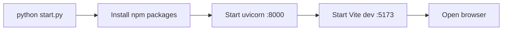

# Installation

> [!abstract] TL;DR
> ```bash
> git clone https://github.com/gsl0001/spy_credit_spread.git
> cd spy_credit_spread
> pip install -r requirements.txt
> python start.py
> ```

## Requirements

| Tool | Version | Why |
|------|---------|-----|
| Python | **3.11 or 3.12** | `ib_insync` breaks on 3.14 |
| Node.js | **18+** | Vite 8 + React 19 frontend |
| pip | latest | Python packages |
| npm | latest | React packages |
| TWS / IB Gateway | latest | Only if you want live trading |
| Alpaca paper account | free | Only if you want paper trading |

> [!tip] Don't have Python 3.11?
> Use [pyenv](https://github.com/pyenv/pyenv) on macOS/Linux or the official installer on Windows. **Avoid Python 3.14** — `ib_insync` is incompatible.

## One-command start

```bash
git clone https://github.com/gsl0001/spy_credit_spread.git
cd spy_credit_spread
pip install -r requirements.txt
python start.py
```

The launcher does everything:



When you see the dashboard at `http://localhost:5173`, you're done.

## Manual start (two terminals)

> [!example] Use this if `start.py` fails

**Terminal 1 — backend:**

```bash
pip install -r requirements.txt
uvicorn main:app --reload --port 8000
```

**Terminal 2 — frontend:**

```bash
cd frontend
npm install
npm run dev
```

Then open `http://localhost:5173`.

## Configuration (`.env`)

Most things work without any env vars. You only need them for headless deployment or to skip typing credentials in the UI.

```bash
cp config/.env.example config/.env
# edit config/.env
```

### What each variable controls

| Variable | Default | Used by |
|----------|---------|---------|
| `IBKR_HOST` | `127.0.0.1` | TWS connection |
| `IBKR_PORT` | `7497` (paper TWS) | TWS connection |
| `IBKR_CLIENT_ID` | `1` | TWS connection |
| `ALPACA_API_KEY` | *(empty)* | Paper trading |
| `ALPACA_API_SECRET` | *(empty)* | Paper trading |
| `ALPACA_BASE_URL` | `https://paper-api.alpaca.markets` | Paper trading |
| `JOURNAL_DB_PATH` | `data/trades.db` | SQLite journal |
| `LOG_DIR` | `logs` | Daily JSON logs |
| `LOG_LEVEL` | `INFO` | Logging verbosity |
| `MAX_CONCURRENT_POSITIONS` | `2` | Risk gate |
| `DAILY_LOSS_LIMIT_PCT` | `2.0` | Risk gate |
| `DEFAULT_STOP_LOSS_PCT` | `50.0` | Default exit |
| `DEFAULT_TAKE_PROFIT_PCT` | `50.0` | Default exit |
| `DEFAULT_TRAILING_STOP_PCT` | `0.0` | Default exit |
| `FILL_TIMEOUT_SECONDS` | `30` | Fill watcher |
| `MONITOR_INTERVAL_SECONDS` | `15` | Position monitor |
| `LIMIT_PRICE_HAIRCUT` | `0.05` | Marketable-limit pricing |
| `EVENT_CALENDAR_FILE` | `config/events_2026.json` | Blackout dates |
| `NOTIFY_WEBHOOK_URL` | *(empty)* | Daily digest |

> [!warning] Never commit a filled-in `.env`
> The repo's `.gitignore` covers `config/.env` already, but double-check before pushing.

## Verifying the install

> [!success] Sanity checks

1. Open `http://localhost:5173` — the dashboard loads
2. Open `http://localhost:8000/docs` — Swagger UI lists 31 routes
3. Click **Backtest** in the sidebar → **Run Backtest** → metrics appear
4. Run `pytest` from the project root → 274 tests pass

## Troubleshooting

| Symptom | Likely cause | Fix |
|---------|--------------|-----|
| `ModuleNotFoundError: ib_insync` | Wrong Python version | Switch to 3.11 or 3.12 |
| Port 8000 already in use | Old uvicorn still running | `lsof -i :8000` then kill |
| Port 5173 already in use | Old Vite running | `lsof -i :5173` then kill |
| Frontend can't reach backend | CORS / wrong port | Check backend is on `:8000` |
| `No module named 'apscheduler'` | Missing deps | `pip install -r requirements.txt` |
| TWS connection refused | API not enabled in TWS | See [[Connecting Brokers]] |

---

Next: [[First Backtest]] · [[Connecting Brokers]]
