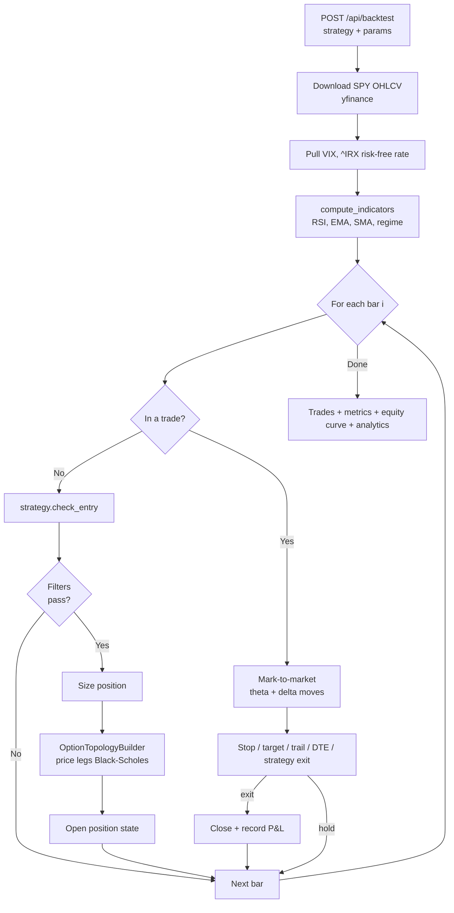
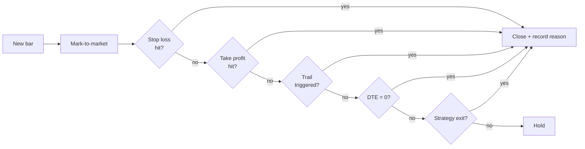

# Backtest Mode

> [!abstract] What it answers
> "If I had run **this strategy** with **these filters** and **this option structure** between **date A and date B**, how would I have done?"

## The simulation engine

## What you control

> [!info] Three layers of knobs

### 1. Strategy params

The strategy you pick exposes its own fields. See [[Consecutive Days]] and [[Combo Spread]] for parameter lists.

### 2. Topology + direction

What option structure to use and which way you're betting:

- `vertical_spread` (bull / bear)
- `long_call` (auto-swaps to long put on bear)
- `straddle` (neutral)
- `iron_condor` (neutral)
- `butterfly` (neutral)

See [[Topology Overview]].

### 3. Filters + risk + sizing

- Entry filters → [[Entry Filters]]
- Exit controls (stop / target / trail / DTE)
- Position sizing → fixed contracts, dynamic % of equity, or targeted spread %

## Pricing model

> [!info] Closed-form Black-Scholes
> European call/put pricing using:
> - Spot **S** = SPY close on the bar
> - Strike **K** rounded to whole dollars
> - Time **T** = days to expiry / 252
> - Rate **r** = current ^IRX
> - Vol **σ** = 21-day rolling realized × `iv_realism_factor` (default 1.15)

The 1.15 factor approximates the gap between realized and implied volatility — empirically IV trades a bit above realized.

## Mark-to-market

Every bar, every leg is re-priced with the new spot, the new days-to-expiry (theta decay), and the rolling vol. The trade's P&L is the current net price minus your entry net price.

## Position sizing

| Method | What it does |
|--------|--------------|
| **Fixed contracts** | Always N contracts |
| **Dynamic** | Risk X % of equity per trade, capped by an optional dollar max |
| **Targeted spread %** | Size to X % of capital, bounded by max allocation |

## Exit triggers

## Result tabs

After a run, four tabs appear:

| Tab | What's there |
|-----|--------------|
| **Chart** | Candles + entry/exit markers · equity curve |
| **Trades** | Trade log, sortable, with regime + reason |
| **Analytics** | Duration histogram · Monte Carlo · regime split · walk-forward |
| **Optimizer** | 2-param grid search, sortable, best row highlighted |

## Presets

> [!tip] Save a preset whenever a config feels like a keeper
> Click **Save Preset**, give it a name. Stored in `localStorage`. Delete from the UI anytime. Built-ins are always available.

Built-ins:

- **Conservative** — wide stops, tight take-profit
- **Aggressive** — tighter stops, larger size
- **Post-Crash** — designed for VIX > 30 environments
- **Low-Vol Scalp** — tighter trailing in low-VIX
- **Bear Market** — bear path defaults

## Interpreting results

> [!warning] Numbers lie
> A backtest that looks profitable can fail in production for many reasons:
>
> - **Survivorship bias** — yfinance gives you SPY which still exists
> - **Look-ahead bias** — using close prices to enter at close (mitigated by the engine)
> - **Slippage** — real fills miss the midpoint
> - **Curve fitting** — too many knobs tuned to the same dataset
>
> Cross-validate with the **walk-forward** view and **Monte Carlo** confidence band before trusting any preset.

## Known engine limitations

- Daily bars only (no intraday)
- Black-Scholes (European) — real SPY options are American
- Expiry approximated as nearest weekday from `today + target_dte`
- Iron condor margin currently treats credit as equity (bug, see Known Issues)
- `compute_indicators` is called twice per run (latency, not correctness)

---

Next: [[Scanner Mode]] · [[Strategy Overview]] · [[Topology Overview]]
