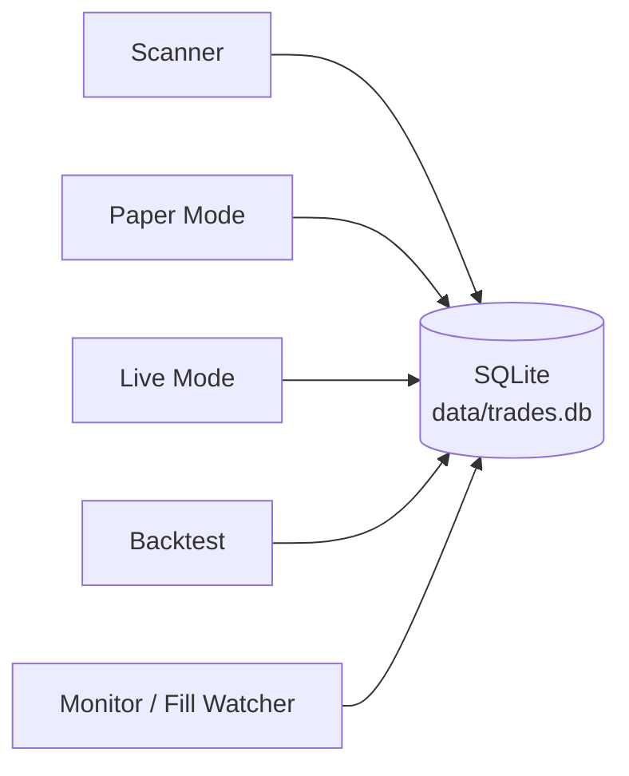
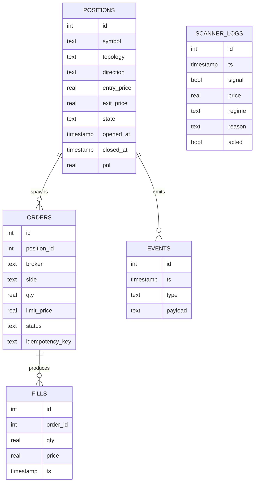
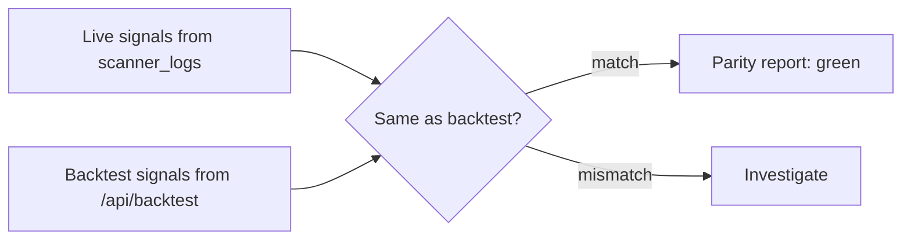

# Journal Mode

> [!abstract] What it is
> A read-only window into the **SQLite journal** at `data/trades.db`. Every order, fill, position, signal, and audit event lands here. This is your *source of truth*.

## Why a journal?

Brokers can be slow to confirm fills. Logs can rotate. Memory deceives. The journal gives you a **single, append-only ledger** you can re-read forever.



## Schema overview



## What the UI shows

| Tab | What it lists |
|-----|---------------|
| **Open Positions** | Live & paper positions still active |
| **Closed Positions** | Historical trades + P&L |
| **Daily P&L** | Today + N-day rolling history |
| **Event Log** | Audit trail (connection events, kill switch fires, etc.) |
| **Reconciliation** | Backtest ↔ live signal/P&L parity report |

## Reconciliation

> [!info] The parity check
> Compares signals the **scanner fired live** against the **backtest engine's signals on the same dates**. Mismatches usually mean the live data wasn't aligned with backtest data (corporate action, late bar, etc.).



Endpoint: `GET /api/journal/reconciliation`.

## Exporting

> [!tip] Plain SQLite — query freely
> ```bash
> sqlite3 data/trades.db
> sqlite> .schema
> sqlite> SELECT * FROM positions WHERE state='closed' ORDER BY closed_at DESC LIMIT 20;
> ```
> Export to CSV with `.mode csv` and `.output trades.csv`.

## Idempotency

> [!warning] Don't double-fire orders
> The `orders` table enforces a unique `idempotency_key`. The scanner and UI should generate a stable key per signal (timestamp + signal hash). If they retry on a network blip, the second insert is rejected — the order doesn't double.
>
> Status today: schema enforces it, but emitters don't always pass keys (tracked as I5 in the deployment plan).

## Common queries

```sql
-- Today's realized P&L
SELECT SUM(pnl) AS day_pnl
FROM positions
WHERE state='closed'
  AND closed_at >= date('now','start of day');

-- Win rate by regime
SELECT regime,
       COUNT(*) trades,
       SUM(CASE WHEN pnl > 0 THEN 1 ELSE 0 END) wins,
       100.0 * SUM(CASE WHEN pnl > 0 THEN 1 ELSE 0 END) / COUNT(*) win_rate
FROM positions
WHERE state='closed'
GROUP BY regime;

-- Last 30 scan ticks
SELECT ts, signal, price, regime, reason
FROM scanner_logs
ORDER BY ts DESC
LIMIT 30;
```

---

Next: [[Risk Mode]] · [[Live Mode]]
