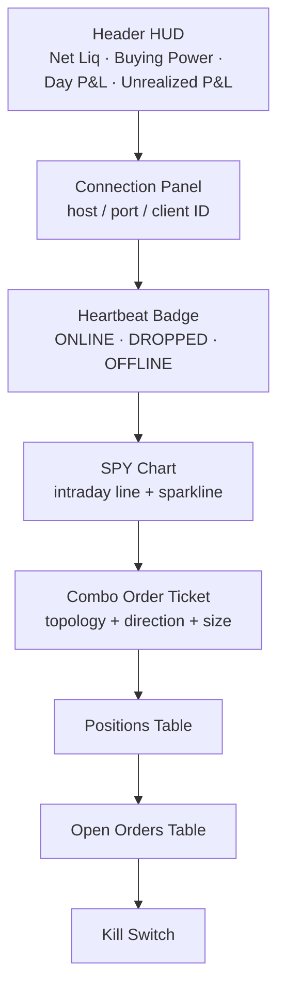
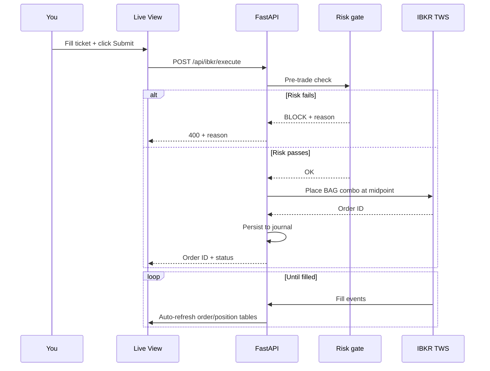
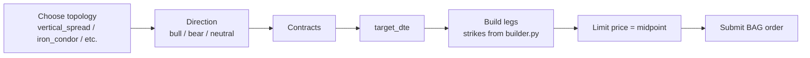

# Live Mode

> [!danger] Real money
> Every order placed here hits real markets. Test in [[Paper Mode]] first.

## What it does

Connects to **Interactive Brokers TWS / Gateway** and lets you place multi-leg option orders, watch positions in real time, and kill everything with one button.

## Anatomy of the screen

## The flow of a live trade

## Connection panel

| Field | Default | Notes |
|-------|---------|-------|
| Host | `127.0.0.1` | Where TWS runs |
| Port | `7497` | **7497 = paper TWS · 7496 = live TWS** |
| Client ID | `1` | Unique per connection |

The badge live-updates every 15 s.

## Header HUD

| Metric | Source |
|--------|--------|
| Net Liquidation | `accountSummary` from TWS |
| Buying Power | `accountSummary` from TWS |
| Day P&L | `accountSummary` from TWS |
| Unrealized P&L | `accountSummary` from TWS |

## The combo ticket

> [!info] What's a "combo"?
> A combo (or BAG contract) is a multi-leg order TWS treats as a single unit. The fill is all-or-nothing.

> [!warning] MVP scope
> Only `vertical_spread` (bull call) is fully wired into `/api/ibkr/execute` for live. Other topologies render correctly in the backtest engine but require additional QA before live wiring.

## Heartbeat & alerts

Every 15 s `/api/ibkr/heartbeat` runs:

- **Alive check** — TWS responds to `reqCurrentTime`
- **Scheduler check** — APScheduler jobs are healthy
- **Alert generator** — produces alerts if anything looks off

If a webhook URL is set in `.env`, alerts can be posted to Slack/Discord/etc.

## Test order

Click **Test Order** to submit a non-filling SPY limit buy at $1.05. It exists to verify:

1. The TWS API path is live
2. The journal records orders
3. The frontend displays the order in the table

It will sit unfilled forever — cancel it from the table.

## Kill switch

> [!danger] What it does
> `POST /api/ibkr/flatten_all` cancels all open orders and submits closing orders for every open position. Stops the scanner if running.

Use when:

- You see something you don't recognise
- The market is doing something extreme
- You're stepping away from the desk

## Auto-refresh cadences

| Thing | Interval |
|-------|----------|
| Heartbeat | 15 s |
| Positions table | 30 s (or after order events) |
| Open orders table | 30 s (or after order events) |
| SPY chart | 60 s |

---

Next: [[Paper Mode]] · [[Risk Mode]]
