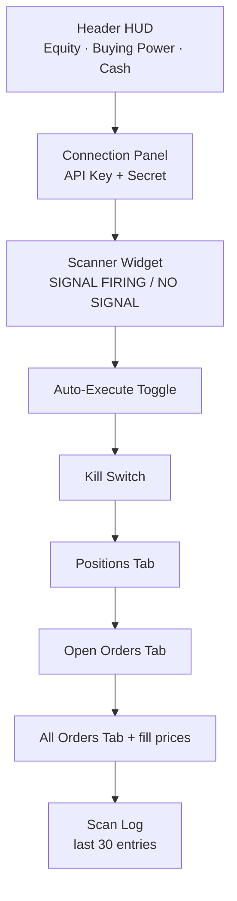
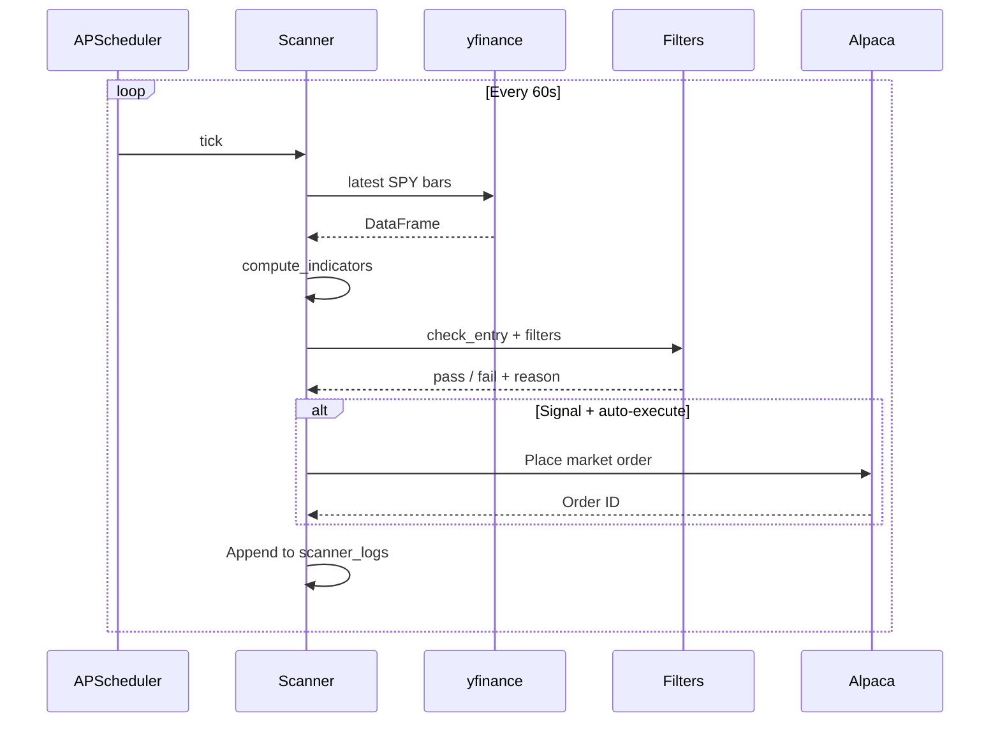
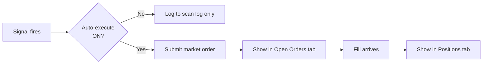

# Paper Mode

> [!abstract] Why use it
> Practice the **full execution loop** with fake money before risking real capital. Same signal logic as backtest and live, but routed to Alpaca's paper account.

## What it does

Connects to your **free Alpaca paper account**, scans the live market on a schedule, and (optionally) auto-submits orders the moment a signal fires.

## Screen anatomy



## The scan loop



## Signal widget

The most important box on the screen. Tells you:

| Field | Meaning |
|-------|---------|
| **State** | `SIGNAL FIRING` (green) or `NO SIGNAL` (gray) |
| Price | Latest SPY close |
| RSI value | Current RSI reading |
| RSI filter | `pass` / `fail` / `off` |
| EMA filter | `pass` / `fail` / `off` |

If state is `SIGNAL FIRING` and **all filters pass**, an order will fire (when auto-execute is on).

## Auto-execute

> [!warning] What auto-execute does
> Submits a **market order** to Alpaca the moment a signal fires. No confirmation prompt. Toggle this OFF until you trust your config.



## Kill switch

`POST /api/paper/kill_switch` (also wired to a button) does two things:

1. **Stops the scanner** so no new signals fire
2. **Submits closing orders** for every open position

Useful when you want to walk away cleanly.

## What's tracked in the journal

Every order, fill, and signal is written to SQLite (`data/trades.db`). View it in [[Journal Mode]] or query directly:

```sql
SELECT * FROM scanner_logs ORDER BY ts DESC LIMIT 30;
SELECT * FROM orders ORDER BY ts DESC LIMIT 30;
```

## Refresh cadences

| Thing | Interval |
|-------|----------|
| Header HUD | 30 s |
| Scanner widget | 3 s |
| Positions / orders | 30 s |

## Equity surrogate vs real options

> [!info] Heads up
> Currently Paper Mode places **SPY equity orders** (buy/sell shares) as a stand-in for option fills. Alpaca now supports real options orders — this is on the roadmap. For real options paper trading today, point IBKR to **paper TWS port 7497**.

| Goal | Use |
|------|-----|
| End-to-end signal validation, no real money | Alpaca Paper Mode |
| Real option fills, no real money | IBKR paper TWS (7497) |
| Real option fills, real money | IBKR live TWS (7496) |

---

Next: [[Backtest Mode]] · [[Live Mode]]
