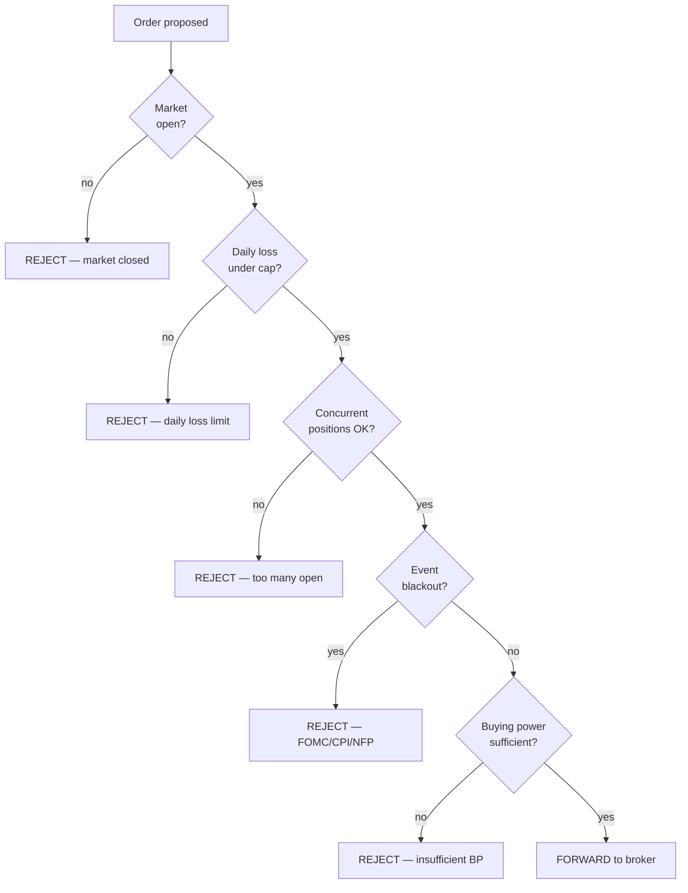
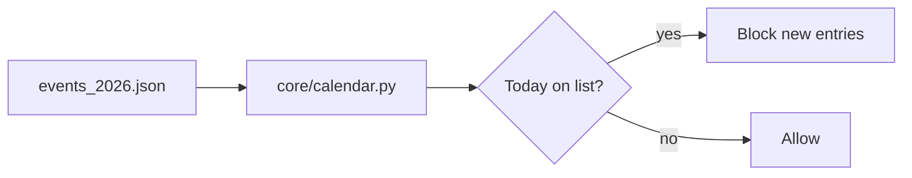
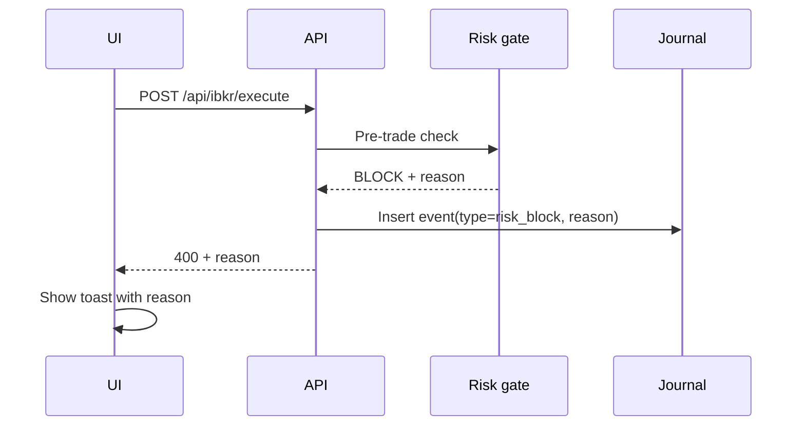

# Risk Mode

> [!abstract] The firewall
> Risk Mode shows you the **pre-trade gate** that every order must pass — *before* the broker sees it. If any check fails, the order is rejected and the reason is logged.

## The five gates



## What you see on the screen

| Tile | What it tells you |
|------|-------------------|
| **Concurrent cap** | "1 of 2 used" |
| **Daily loss** | "Today: -0.4%, cap: -2.0%" |
| **Market hours** | "Open" / "Closed" |
| **Event blackout** | "Clear" / "FOMC at 2pm" |
| **Buying power utilization** | "23% used" |

Each tile is **green** when safe, **yellow** approaching limit, **red** when blocked.

## The five gates explained

### 1. Market hours

Source: `core/calendar.py` — checks NYSE schedule, US holidays, half days. The platform refuses to trade outside RTH (regular trading hours) by default.

### 2. Daily loss limit

Source: `core/risk.py` reading from `core/journal.py`. Sums today's realized P&L. If it exceeds `DAILY_LOSS_LIMIT_PCT` of equity (default **2 %**), all new orders are blocked until tomorrow.

> [!warning] Why this matters
> Without a daily loss cap, a bad signal can compound losses across the day. The cap is a circuit breaker.

### 3. Concurrent position cap

Default `MAX_CONCURRENT_POSITIONS=2`. Stops you from opening a third position while two are still active.

> [!info] Why a cap?
> Correlation. SPY-only strategies are highly correlated trade-to-trade. Three positions = one big bet. Two = two half bets.

### 4. Event blackout

Source: `core/calendar.py` reading `config/events_2026.json`. The file lists FOMC meetings, CPI prints, NFP releases. The platform refuses to open new positions on those days (configurable).



> [!tip] Update the file annually
> Drop a new `events_2027.json` in `config/` and update `EVENT_CALENDAR_FILE` in `.env`.

### 5. Buying power

Reads broker buying power. Refuses orders that would exceed it. For Margin/PortfolioMargin accounts, IBKR computes the requirement.

## Tuning the gates

```bash
# config/.env
MAX_CONCURRENT_POSITIONS=2
DAILY_LOSS_LIMIT_PCT=2.0
DEFAULT_STOP_LOSS_PCT=50.0
DEFAULT_TAKE_PROFIT_PCT=50.0
DEFAULT_TRAILING_STOP_PCT=0.0
FILL_TIMEOUT_SECONDS=30
MONITOR_INTERVAL_SECONDS=15
LIMIT_PRICE_HAIRCUT=0.05
```

> [!example] Tighter risk for new strategies
> Until a strategy proves itself, run with:
> - `MAX_CONCURRENT_POSITIONS=1`
> - `DAILY_LOSS_LIMIT_PCT=1.0`
>
> Loosen only after the journal shows consistent green months.

## What happens on a block



The audit trail in [[Journal Mode]] will show the rejection so you can audit *why* trades didn't fire later.

## Kill switch — the override

When everything is wrong, the **kill switch** bypasses normal flow:

- `POST /api/ibkr/flatten_all` — close all IBKR positions
- `POST /api/paper/kill_switch` — close all Alpaca positions

Both endpoints also stop the scanner so no new orders fire.

---

Next: [[Live Mode]] · [[Journal Mode]]
