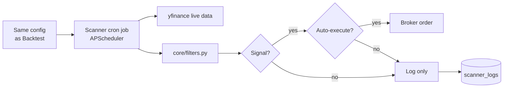
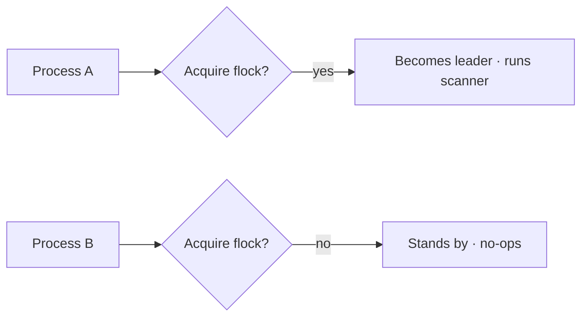

# Scanner Mode

> [!abstract] In one line
> A background job that re-runs your strategy's signal logic on **live** data, every N seconds, optionally placing real orders when the signal fires.

## Why it exists

Backtests find good rules. Live trading needs a robot that **doesn't blink**, doesn't get distracted, and doesn't second-guess the rules. That robot is the scanner.

## Cadence options

The scanner can fire on different schedules:

| Cadence | When it ticks |
|---------|---------------|
| `interval` | Every N seconds (default 60) |
| `after_open` | A few seconds after the market opens |
| `before_close` | A few minutes before the market closes |
| `on_open` | Exactly at the open bell |

Pick based on your strategy. Mean reversion plays often want `after_open`. Day-end plays want `before_close`.

## Single-leader election

> [!info] Why this matters
> If two backend processes both ran the scanner, you'd get duplicate orders. `core/leader.py` uses `fcntl.flock` on a sentinel file so only one process becomes the leader.

Restart the leader and the standby takes over (after the OS releases the lock).

## What gets logged

Every tick produces a `scanner_log` row in SQLite:

| Column | Example |
|--------|---------|
| `ts` | `2026-04-30T14:30:00Z` |
| `signal` | `true` / `false` |
| `price` | `512.34` |
| `rsi` | `28.4` |
| `rsi_pass` | `true` |
| `ema_pass` | `false` |
| `volume_pass` | `true` |
| `regime` | `bull` |
| `reason` | `entry_red_days satisfied; ema filter failed` |
| `acted` | `true` if order placed |
| `order_id` | broker order ID if acted |

View the last 30 in the Scanner widget, or query the journal in [[Journal Mode]].

## Endpoints used

| Method | Path | What |
|--------|------|------|
| POST | `/api/scanner/start` | Start the cron job |
| POST | `/api/scanner/stop` | Stop the cron job |
| GET | `/api/scanner/status` | Status + recent logs |

## Auto-execute safety

> [!danger] Sharp tool
> Auto-execute submits market orders the moment a signal fires. There is **no human in the loop**.
>
> Best practice:
>
> 1. Run scanner with **auto-execute OFF** for several days
> 2. Read the scan log — would you have wanted those trades?
> 3. Tighten filters / risk gates if the answer is "no"
> 4. Only then enable auto-execute, with a **kill switch** ready

## Tips for clean signals

- **Tighten filters before tightening the strategy.** Filters are cheap to add/remove; strategy edits change the math.
- **Watch the scan log every morning** — the *near-misses* show whether your rules are too strict or too loose.
- **Use `before_close` cadence to avoid intraday noise** if you're a swing trader.
- **Use `after_open` cadence for mean-reversion** since the open often has the cleanest setups.

---

Next: [[Journal Mode]] · [[Risk Mode]]
