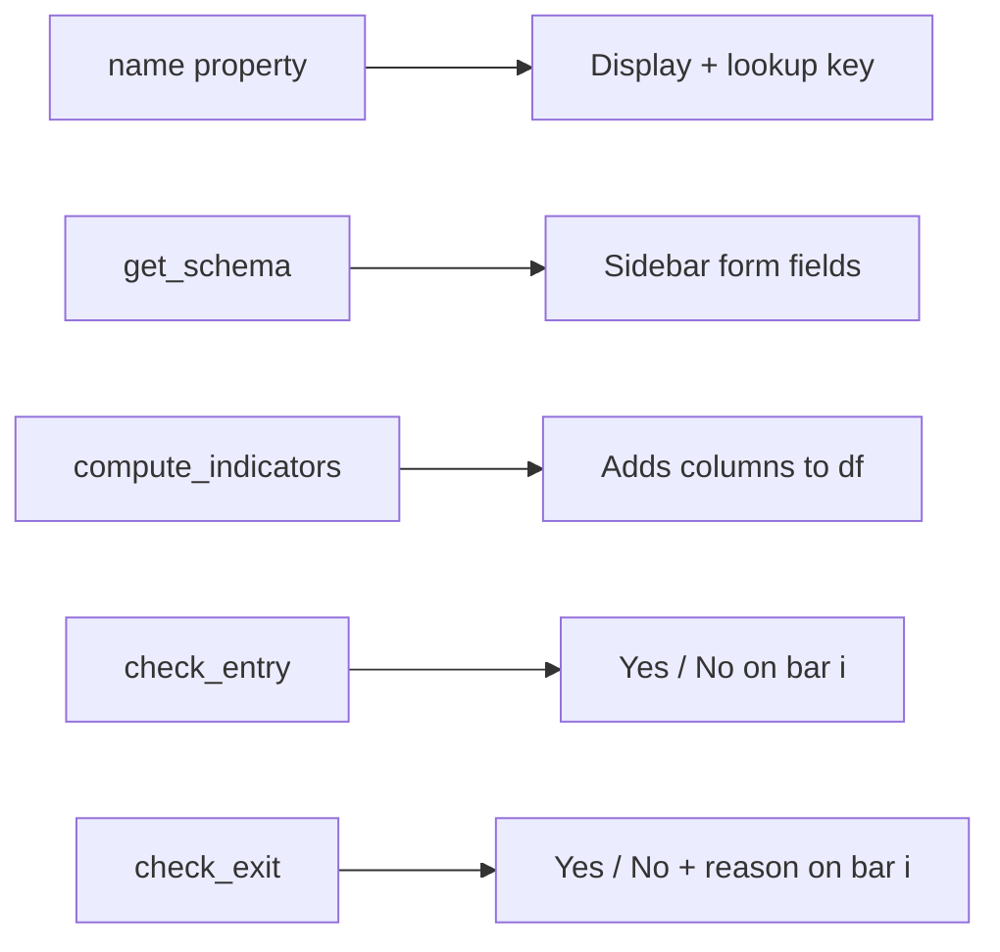

# Building Your Own Strategy

> [!abstract] In four steps
> 1. Subclass `BaseStrategy`
> 2. Implement four methods
> 3. Register in `StrategyFactory.STRATEGIES`
> 4. Add it to the sidebar (optional — schema-driven sidebar coming)

## Step 1 — File scaffold

Create `strategies/my_strategy.py`:

```python
import pandas as pd
from strategies.base import BaseStrategy


class MyStrategy(BaseStrategy):
    name = "my_strategy"

    @classmethod
    def get_schema(cls) -> dict:
        return {
            "fields": [
                {"key": "rsi_low", "label": "RSI threshold", "type": "number", "default": 30},
                {"key": "lookback", "label": "Lookback bars", "type": "number", "default": 5},
            ]
        }

    def compute_indicators(self, df: pd.DataFrame, req) -> pd.DataFrame:
        # Add your strategy-specific columns
        df["my_signal"] = df["close"].rolling(req.lookback).mean()
        return df

    def check_entry(self, df: pd.DataFrame, i: int, req) -> bool:
        if i < req.lookback:
            return False
        # Example: enter when close < lookback mean and RSI is low
        return (
            df["close"].iat[i] < df["my_signal"].iat[i]
            and df["rsi"].iat[i] < req.rsi_low
        )

    def check_exit(self, df: pd.DataFrame, i: int, state: dict, req) -> tuple[bool, str]:
        if df["close"].iat[i] > df["my_signal"].iat[i]:
            return True, "mean_reverted"
        return False, ""
```

## Step 2 — What each method must do



> [!info] Convention
> - **Pure** — don't mutate `req`. Read only.
> - **Idempotent** — calling `compute_indicators` twice gives the same df.
> - **Index-safe** — guard `i` against early bars (`if i < n: return False`).
> - **Vectorized when possible** — but the engine accepts row-by-row logic too.

## Step 3 — Register

Open `main.py` and find `StrategyFactory.STRATEGIES`:

```python
from strategies.my_strategy import MyStrategy

class StrategyFactory:
    STRATEGIES = {
        "consecutive_days": ConsecutiveDaysStrategy,
        "combo_spread": ComboSpreadStrategy,
        "my_strategy": MyStrategy,   # <- add this
    }
```

## Step 4 — Test

> [!tip] Use the Backtest API directly first
> ```bash
> curl -X POST http://localhost:8000/api/backtest \
>   -H "Content-Type: application/json" \
>   -d '{"strategy":"my_strategy","rsi_low":25,"lookback":7,"topology":"vertical_spread","direction":"bull","start":"2024-01-01","end":"2025-12-31"}'
> ```

If you see metrics + trades in the response, you're done. The frontend will show your strategy in the dropdown automatically (the schema drives the form fields if the schema-driven sidebar is wired; otherwise edit JSX manually).

## Common pitfalls

> [!warning] Look-ahead bias
> Never use `df["close"].iat[i+1]` inside `check_entry`. The engine fires entries on the *open of bar i+1* using close-of-bar-i decisions. Reading the future = fake profits.

> [!warning] Indicator leakage
> If your indicator uses `df["close"].rolling(20).mean()`, the first 19 values are NaN. Guard against it: `if pd.isna(df["my_indicator"].iat[i]): return False`.

> [!warning] Exit reasons
> Return a non-empty string from `check_exit` so the journal shows *why* you exited. Future-you will thank present-you.

## Recommended structure for serious work

```
strategies/
  base.py
  my_strategy/
    __init__.py
    strategy.py
    indicators.py
    tests/
      test_entry.py
      test_exit.py
```

Then add unit tests:

```python
# strategies/my_strategy/tests/test_entry.py
import pandas as pd
from strategies.my_strategy import MyStrategy

def test_fires_on_oversold():
    df = pd.DataFrame({
        "close": [100, 99, 98, 97],
        "rsi":   [50, 40, 30, 20],
    })
    req = type("R", (), {"rsi_low": 25, "lookback": 2})()
    s = MyStrategy()
    df = s.compute_indicators(df, req)
    assert s.check_entry(df, 3, req) is True
```

Run with `pytest strategies/my_strategy/tests/`.

## Sharing indicators across strategies

> [!tip] Don't copy-paste
> Right now `consecutive_days` and `combo_spread` each compute RSI/EMA/SMA independently. The cleaner pattern is to add `_add_base_indicators(df, req)` to `base.py` and call it from each strategy's `compute_indicators`. Open issue, easy refactor.

---

Next: [[Topology Overview]] · [[Strategy Overview]]
