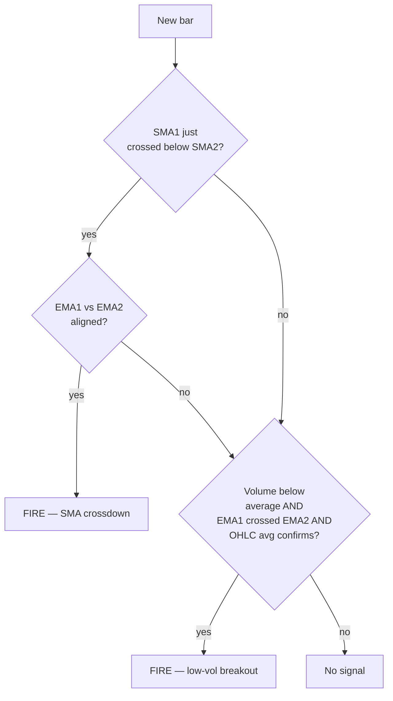

# Combo Spread (Trend / Volume Breakout)

> [!abstract] The intuition
> Two ways to enter:
> 1. **SMA crossdown** — short SMA crosses below medium SMA, *and* EMA confirms direction
> 2. **Low-volume EMA breakout** — quiet day, but price punches through both EMAs and the OHLC average

It's a hybrid trend / breakout strategy that fires when momentum and trend agree.

## Entry conditions



## Exit conditions

Two exit paths in addition to universal stops/targets:

| Trigger | Setting | What it does |
|---------|---------|--------------|
| **Time-based** | `combo_max_bars` | Force close after N bars |
| **Profit-count** | `combo_max_profit_closes` | Close after N profitable bars in a row |

## Parameters

| Key | Default | Meaning |
|-----|---------|---------|
| `combo_sma1` | 3 | Fast SMA |
| `combo_sma2` | 8 | Medium SMA |
| `combo_sma3` | 10 | Slow SMA (context) |
| `combo_ema1` | 5 | Trend EMA |
| `combo_ema2` | 3 | Confirmation EMA |
| `combo_max_bars` | 10 | Max bars to hold |
| `combo_max_profit_closes` | 3 | Profit-bar exit count |

## Where it shines

| Market | Why |
|--------|-----|
| **Trending up / down** | Crossovers align with momentum |
| **Quiet breakouts** | Catches the early phase of a regime shift |

## Where it fails

> [!warning] Choppy whipsaws
> Sideways markets cause crossovers that immediately reverse. Pair with a **regime filter** (`use_regime_filter=true`, `regime_allowed=bull` or `bear`) to skip sideways days.

## Example config

```json
{
  "strategy": "combo_spread",
  "combo_sma1": 3,
  "combo_sma2": 8,
  "combo_ema1": 5,
  "combo_ema2": 3,
  "combo_max_bars": 10,
  "combo_max_profit_closes": 3,
  "topology": "vertical_spread",
  "direction": "bull",
  "target_dte": 21,
  "stop_loss_pct": 40,
  "take_profit_pct": 60,
  "use_volume_filter": true,
  "use_regime_filter": true,
  "regime_allowed": "bull"
}
```

> [!example] Reading this config
> "When fast SMA crossdown matches the EMA trend (or a low-vol EMA breakout fires), buy a 21-DTE bull call vertical. Use a volume filter and require bull regime. Exit at 40% loss, 60% gain, after 10 bars, or after 3 profit bars in a row."

## Tuning tips

- **Tighter SMAs** (`sma1=2, sma2=5`) trigger more often but produce more whipsaws.
- **Wider SMAs** (`sma1=5, sma2=13`) catch only major shifts.
- **`combo_max_bars`** is your time-stop — keeps capital from rotting in stale trades.
- **`combo_max_profit_closes`** is a soft profit-take — it locks gains without an aggressive limit.
- Pair with **volume filter** to skip days the market is asleep on.

---

Next: [[Consecutive Days]] · [[Building Your Own]]
