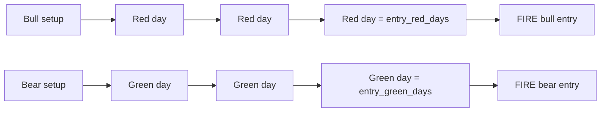
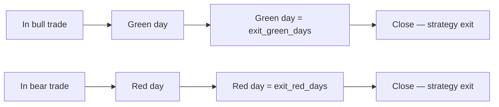

# Consecutive Days (Mean Reversion)

> [!abstract] The intuition
> Markets that fall N days in a row tend to bounce. Markets that rise N days in a row tend to pause. This strategy enters on the **N-th** consecutive directional candle and exits on **M** counter-directional candles.

## When it fires



## When it exits



The engine **also** applies the universal exit triggers (stop loss, take profit, trailing stop, DTE expiry) on top.

## Parameters

| Key | Default | Description |
|-----|---------|-------------|
| `entry_red_days` | 3 | Bull: enter after this many red candles |
| `entry_green_days` | 3 | Bear: enter after this many green candles |
| `exit_green_days` | 1 | Bull: exit after this many green candles |
| `exit_red_days` | 1 | Bear: exit after this many red candles |

## Where it shines

| Market | Why it works |
|--------|--------------|
| **Range-bound SPY** | Mean reversion is the dominant edge |
| **Post-pullback bull** | Catches "buy-the-dip" rhythm |
| **Range-bound bear** | Symmetric — sells the rip |

## Where it fails

> [!warning] Trends destroy mean reversion
> If SPY is trending up for a month, three red days in a row may not bounce — they may be the start of a breakdown. Combine with a regime filter (`use_regime_filter=true`) to avoid bull entries in bear markets.

## Example backtest config

```json
{
  "strategy": "consecutive_days",
  "entry_red_days": 3,
  "exit_green_days": 1,
  "topology": "vertical_spread",
  "direction": "bull",
  "target_dte": 14,
  "stop_loss_pct": 50,
  "take_profit_pct": 50,
  "use_rsi_filter": true,
  "rsi_threshold": 30,
  "use_regime_filter": true,
  "regime_allowed": "bull"
}
```

> [!example] Reading this config
> "After 3 red days in a row, **and** RSI < 30, **and** market regime is bullish → buy a 14-DTE bull call vertical spread. Exit on 1 green day, or 50% loss, or 50% gain, or expiry, whichever first."

## Tuning tips

- **`entry_red_days = 3`** is the canonical number. Lower (2) → more trades, more noise. Higher (4-5) → fewer trades, deeper pullbacks.
- **`exit_green_days = 1`** captures the bounce quickly. Increase to 2 if you want to ride more of the move.
- Pair with **RSI < 30** filter to avoid catching falling knives.
- Pair with **regime = bull** filter to avoid bear-market dips.
- Use a **stop_loss_pct of 50%** to cap downside per trade.

---

Next: [[Combo Spread]] · [[Building Your Own]]
