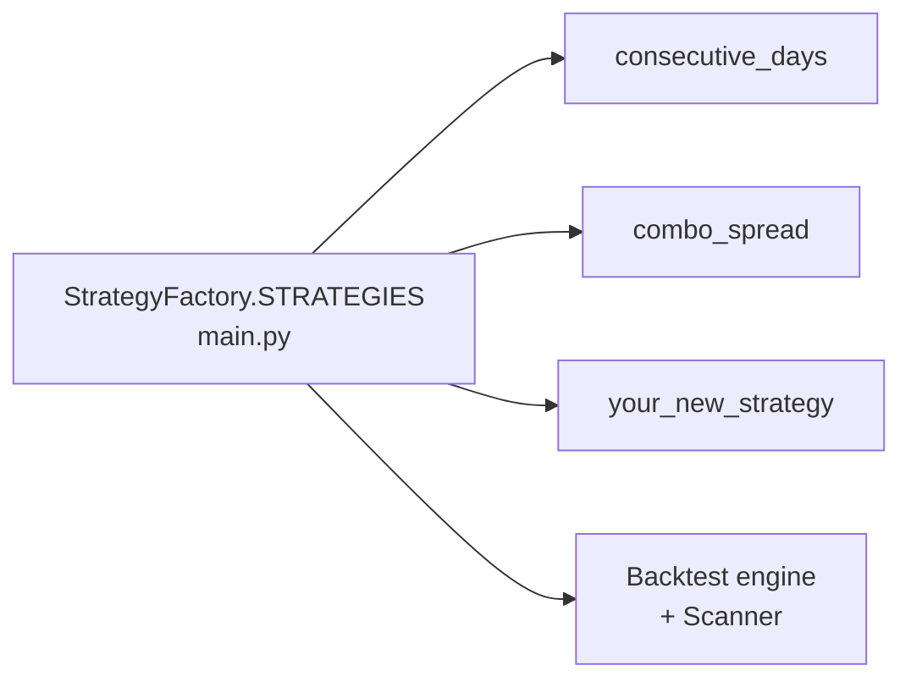
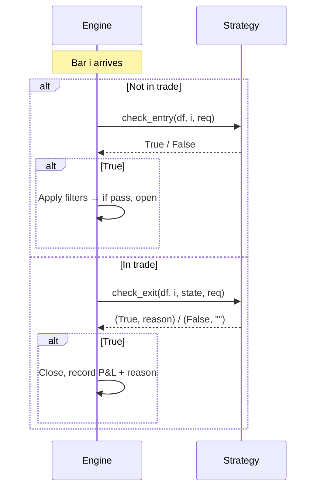
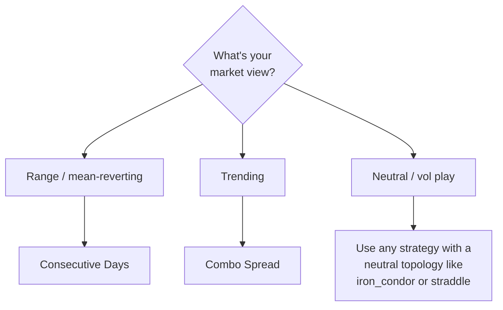

# Strategy Overview

> [!abstract] In one line
> A **strategy** is a small Python class that says "yes, enter now" or "yes, exit now" on every bar.

## The contract

Every strategy implements four methods:

```python
class BaseStrategy(ABC):
    name: str

    @classmethod
    def get_schema(cls) -> dict: ...

    def compute_indicators(self, df, req) -> pd.DataFrame: ...

    def check_entry(self, df, i, req) -> bool: ...

    def check_exit(self, df, i, state, req) -> tuple[bool, str]: ...
```

That's it. The engine takes care of pricing, risk gates, sizing, journaling, and broker plumbing.

## Built-in strategies

| Strategy | Idea | Best in |
|----------|------|---------|
| [[Consecutive Days]] | Buy after N red days, sell after M green days | Mean-reverting / range-bound markets |
| [[Combo Spread]] | SMA crossdown + EMA confirmation, or low-volume EMA breakout | Trending markets with volume signals |

## How strategies plug in



When the user picks a strategy in the sidebar, the API receives `strategy: "consecutive_days"` and looks it up in the registry.

## Anatomy of a tick



## Choosing the right strategy

> [!info] Which one fits my view?



## Custom strategies

Want a momentum breakout? An IV crush play? A custom regime filter? See [[Building Your Own]].

---

Next: [[Consecutive Days]] · [[Combo Spread]] · [[Building Your Own]]
