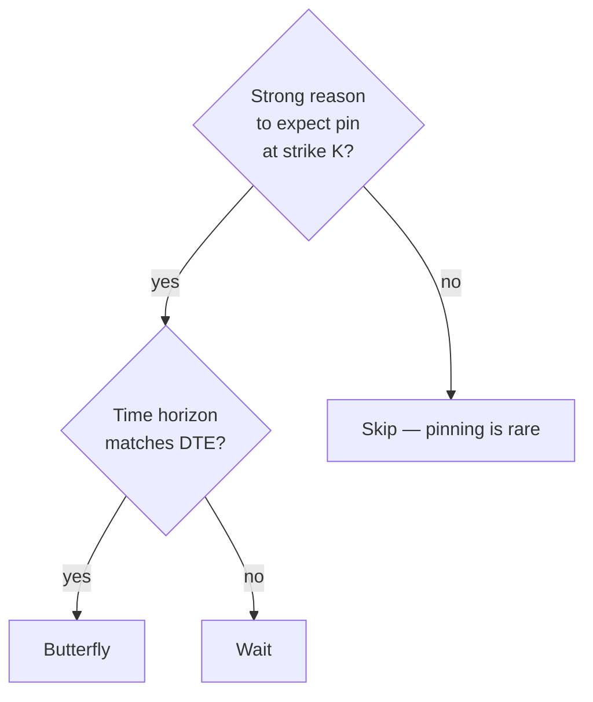

# Butterfly

> [!abstract] What it is
> Three strikes, three legs. Long one ATM, short two OTM, long one far-OTM. You profit if SPY *pins* near the middle strike at expiry.

## P&L shape

```
P&L
        /\
       /  \
      /    \
_____/______\_____ price
   K1    K2    K3
  (long) (2 short) (long)

Max gain = (K2-K1) - debit, peaks at K2
Max loss = debit paid (at extremes)
```

## Construction

| Leg | Type | Side | Quantity | Strike |
|-----|------|------|----------|--------|
| 1 | call (or put) | LONG | 1 | K1 = ATM |
| 2 | call (or put) | SHORT | 2 | K2 = K1 + strike_width |
| 3 | call (or put) | LONG | 1 | K3 = K1 + 2 × strike_width |

The 1-2-1 ratio is what gives it the tent shape.

## Why use it

| Benefit | Why |
|---------|-----|
| **Cheap** | Short legs subsidize the long legs heavily |
| **Defined risk** | Max loss = debit |
| **Huge R:R at the peak** | 5–10× return if it pins |

## Costs

| Drawback | Why |
|----------|-----|
| **Small profit zone** | Price must finish very close to K2 |
| **Low hit rate** | Pinning is rare |
| **Gamma whippy near expiry** | Last few days are wild swings |

## When to use



Common setups:

- **Post-event mean reversion** — vol crush plus expected return to a known level
- **Resistance / support magnet** — psychological price levels
- **Quiet expiration weeks** — late OPEX dynamics

## When NOT to use

> [!warning] Don't use during trending tapes
> A butterfly is a static "I think it'll land here" view. If price is moving steadily, it'll blow past the body and lose the debit.

## Variants the engine could add

| Variant | Difference |
|---------|------------|
| **Iron butterfly** | Sell ATM straddle, buy wings (credit) |
| **Broken-wing butterfly** | Asymmetric wings — directional skew |
| **Reverse butterfly** | Short the body, long the wings — bets on big moves |

## Live wiring status

> [!warning] Backtest only
> 1-2-1 ratios in BAG combos work in TWS but require careful leg ordering. Live wiring pending.

## Sizing tip

> [!tip] Butterflies pin ratios are deceiving
> A butterfly might cost $50 with $450 max profit. That's a tempting 9:1 R:R — but the **probability of profit is often only 10–15%**. Expected value is what matters; size accordingly.

---

Next: [[Topology Overview]] · [[Iron Condor]]
