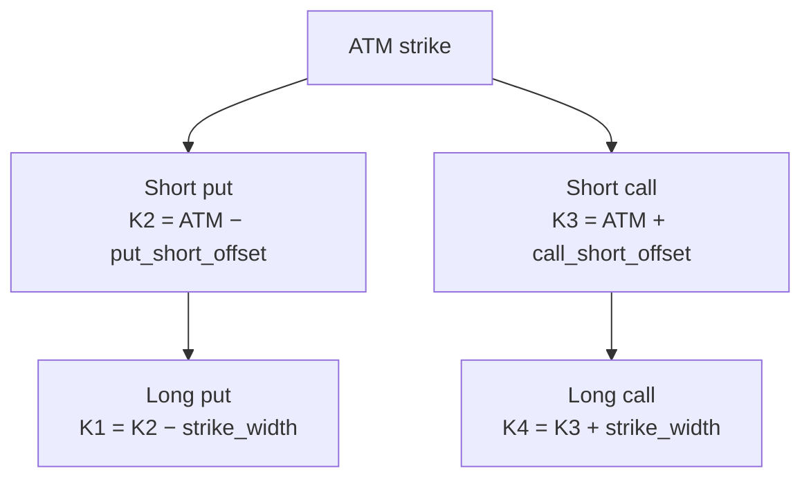

# Iron Condor

> [!abstract] What it is
> Four legs that *collect premium* if SPY stays inside a chosen range. Defined risk on both sides. The classic "neutral" strategy.

## P&L shape

```
P&L
        ___________
       /           \
      /  PROFIT     \
_____/__ZONE_________\______ price
    K1  K2     K3    K4
   (long (short  (short (long
    put)  put)   call)  call)

Max gain = net credit received
Max loss = (strike width × 100) − net credit, per spread
```

## Construction



| Leg | Type | Side | Strike |
|-----|------|------|--------|
| 1 | put | LONG | far OTM (K1) |
| 2 | put | SHORT | OTM (K2) |
| 3 | call | SHORT | OTM (K3) |
| 4 | call | LONG | far OTM (K4) |

## Why use it

| Benefit | Why |
|---------|-----|
| **Theta positive** | Time decay works *for* you |
| **Defined risk** | Wings cap downside on both sides |
| **High win rate** | Markets often stay range-bound |
| **Capital efficient** | Margin = wing width − credit |

## Costs

| Drawback | Why |
|----------|-----|
| **Capped upside** | Max gain = net credit (small) |
| **Asymmetric R:R** | Risk often > 3× reward |
| **Tail risk** | A big move blows through both wings |

## Iron condor margin

> [!warning] Known bug
> Currently the engine treats credit (`net_cost < 0`) as *adding* to equity instead of reserving margin. The correct calculation is:
>
> **margin = (strike_width × 100) − abs(net_credit), per contract**
>
> This is tracked in the bug list and fixed in the deployment plan.

## Win rate vs reward

```
Typical iron condor:
  Width = 5 points
  Credit = $1.50
  Max loss = (5 × 100) − $150 = $350

  Win rate ≈ 70% (in the right environment)
  Avg gain  ≈ $150
  Avg loss  ≈ $200 (managed early)
  Net edge  ≈ break-even unless you exit early
```

> [!info] The early-exit trick
> Pros close iron condors at 50% of max profit (e.g. take $75 of the $150 credit). This dramatically improves the win rate and the realized R:R because you avoid the late-cycle gamma risk.

## When to use

| Market | Why |
|--------|-----|
| **Range-bound** | Premium stays trapped in the wings |
| **Post-event lull** | IV crush after FOMC/earnings → fast decay |
| **Low-VIX regime** | High win rate, less tail risk |

## When NOT to use

> [!warning] Trends destroy condors
> A trending tape pierces the short wing and blows through the long wing into max loss. Iron condors love **chop**, not trends.

## Live wiring status

> [!warning] Backtest only
> Four-leg combo construction is the most complex case. Backtest works; live BAG construction needs QA before going live.

---

Next: [[Butterfly]] · [[Straddle]]
