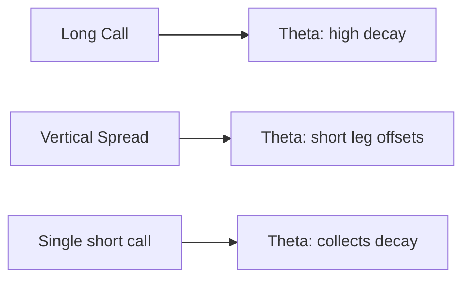

# Long Call & Long Put

> [!abstract] What they are
> Single-leg, defined-risk, *unlimited*-upside directional plays. The simplest option structures.

## Long Call

```
P&L
 |           /
 |          /
 |         /
 |________/_________ price
 |       K
 |  -premium
```

Max loss: premium paid · Max gain: unlimited as price rises

## Long Put

```
P&L
\
 \
  \
___\______________ price
   K
  -premium
```

Max loss: premium paid · Max gain: K minus premium (price → 0)

## Construction

| Topology | Leg | Side | Strike |
|----------|-----|------|--------|
| `long_call` | call | LONG | nearest ATM (bull) |
| `long_put` | put | LONG | nearest ATM (bear) |

> [!info] Auto-swap behavior
> If you select `long_call` with `direction="bear"`, the engine **automatically** swaps to a long put. You don't need to switch topologies based on direction.

## Why use them

| Benefit | Why |
|---------|-----|
| **Unlimited upside** | No short leg capping gains |
| **Single leg = single commission** | Lower friction than spreads |
| **Easy to roll / hedge** | Just one leg to manage |
| **Pure directional bet** | No spread mechanics to think about |

## Costs

| Drawback | Why |
|----------|-----|
| **High premium** | ATM options aren't cheap |
| **Theta is brutal** | A single long option bleeds the most theta |
| **Vega exposure** | A drop in IV slashes value even if price moves your way |

## Theta vs spread



The long call **alone** is theta's biggest victim. If you're directional and time-tolerant, the vertical spread keeps more of your premium when the move takes longer than expected.

## When to pick long over spread

| You want... | Pick |
|------------|------|
| Maximum reward if right | long call/put |
| Defined cost ceiling | vertical spread |
| Lowest cost of carry | vertical spread |
| Cleanest book | long call/put |
| Big asymmetric bet | long call/put |

## Live wiring status

> [!warning] Backtest only (live wiring pending)
> `long_call` and `long_put` work fully in the backtest engine. Live execution via IBKR is on the roadmap — single-leg market/limit orders aren't yet wired into `/api/ibkr/execute`.

## Common misuse

> [!warning] OTM lottery tickets
> Buying 5%-OTM long calls expecting a moonshot looks attractive ("only $50 a contract!") but most expire worthless. Time your entries with **clean trend signals** and stick close to ATM if you want a real hit rate.

---

Next: [[Straddle]] · [[Iron Condor]]
