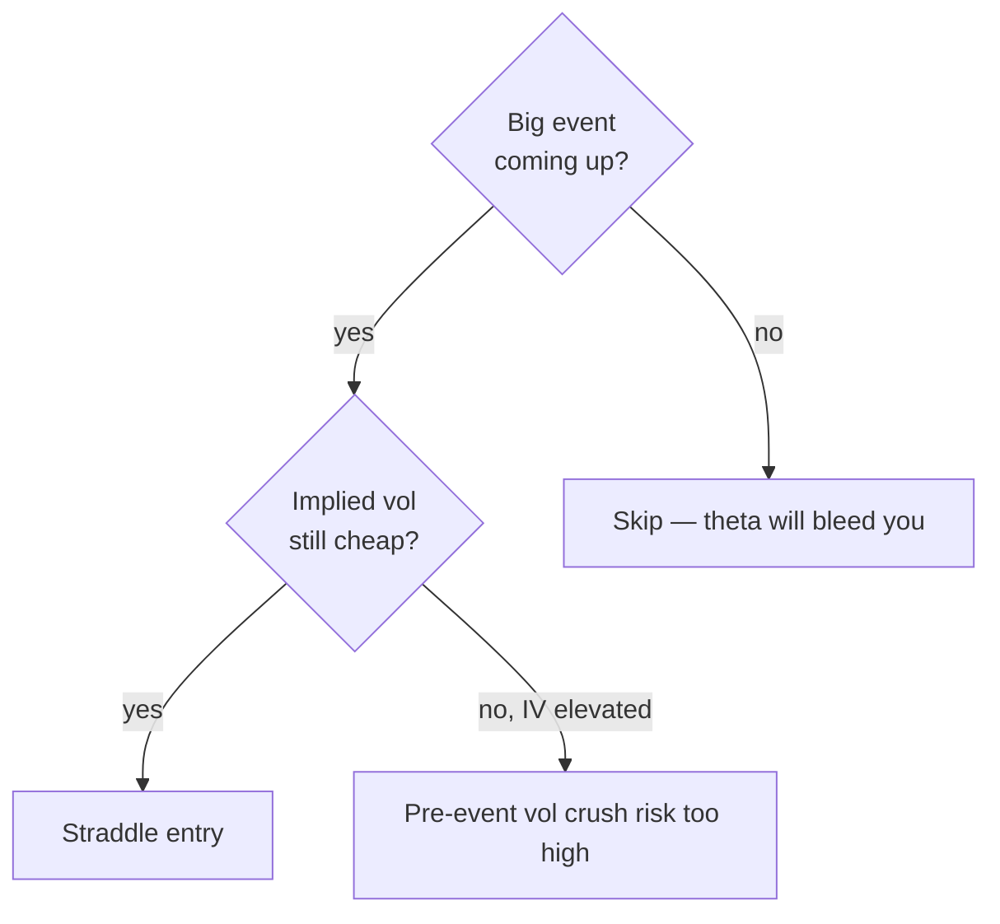

# Straddle

> [!abstract] What it is
> Buy an ATM call and an ATM put with the same strike and expiration. You profit if the price moves a lot — in *either* direction.

## P&L shape

```
P&L
\        /
 \      /
  \    /
   \  /
    \/_______________ price
     K
   -premium total
```

Max loss: total premium (call + put) · Max gain: unlimited up, K-premium down

## Construction

| Leg | Type | Side | Strike |
|-----|------|------|--------|
| 1 | call | LONG | nearest ATM |
| 2 | put | LONG | same ATM strike |

## Why use it

| Benefit | Why |
|---------|-----|
| **Direction agnostic** | Profits if price moves enough either way |
| **Pre-event setups** | Earnings, FOMC, CPI — implied vol expansion plays |
| **Pure vol play** | A bet on realized > implied volatility |

## Costs

| Drawback | Why |
|----------|-----|
| **Double premium** | You pay for both call and put |
| **Wide breakevens** | Price must move *more* than total cost |
| **Vol crush** | After the event, IV collapses and value drops |

## Breakevens

> [!example] SPY straddle at $510, 7 DTE
> - 510 call: ≈ $5.00
> - 510 put: ≈ $4.80
> - Total premium: $9.80
> - **Upper breakeven**: $510 + $9.80 = **$519.80**
> - **Lower breakeven**: $510 − $9.80 = **$500.20**
> - SPY needs to move **±1.9%** in 7 days to break even.

## When to use



## When NOT to use

> [!warning] Calm markets eat straddles for breakfast
> A straddle in a quiet sideways tape decays fast and badly. Theta is twice as harsh because both legs are ATM.

## Variants the engine could support

| Variant | Difference |
|---------|------------|
| **Strangle** | Buy OTM call + OTM put (cheaper, wider breakevens) |
| **Iron butterfly** | Sell ATM straddle, buy OTM wings (defined risk credit) |

These aren't built in yet but are easy additions to `OptionTopologyBuilder`.

## Live wiring status

> [!warning] Backtest only
> Straddle topologies render in the backtest engine but aren't yet wired to live IBKR execution. Multi-leg combo construction works; the bag-leg ordering and ratios just need QA.

---

Next: [[Iron Condor]] · [[Butterfly]]
