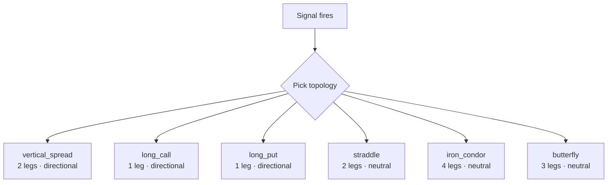
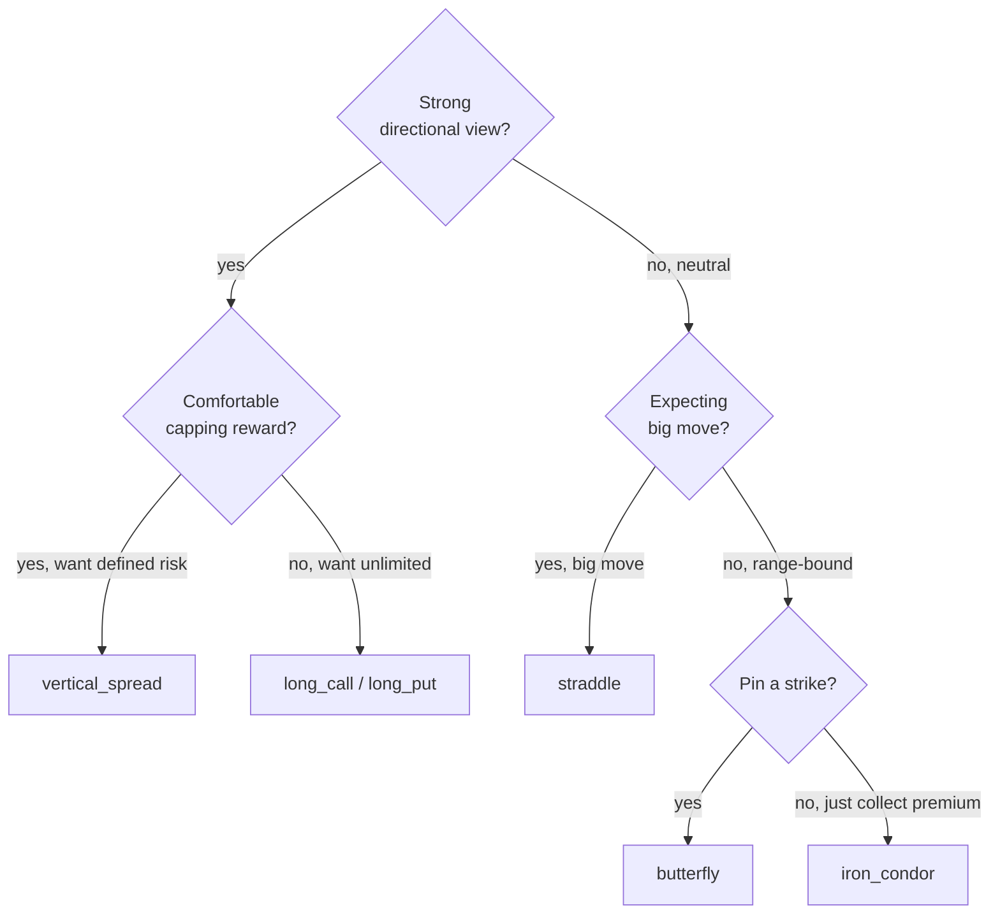

# Topology Overview

> [!abstract] In one line
> A **topology** is the *shape* of an options trade — which strikes, which sides (long/short), which type (call/put). The same signal can use different topologies depending on your view.

## The six built-in shapes

## Comparison table

| Topology | Legs | Direction | Risk | Reward | When to use |
|----------|:---:|-----------|------|--------|-------------|
| `vertical_spread` | 2 | bull / bear | Limited | Limited | Defined-risk directional |
| `long_call` | 1 | bull (auto-puts on bear) | Premium paid | Unlimited | Big directional view |
| `long_put` | 1 | bear | Premium paid | High | Hedging or directional bear |
| `straddle` | 2 | neutral | Premium paid | High both ways | Expecting big move, unsure direction |
| `iron_condor` | 4 | neutral | Defined | Limited credit | Range-bound, premium collection |
| `butterfly` | 3 | neutral | Premium paid | Pinned | Expecting price to settle near a strike |

## Pricing

All topologies are priced with **Black-Scholes (European)** in the backtest engine:

| Input | Source |
|-------|--------|
| Spot S | Latest SPY close |
| Strike K | Rounded ATM ± `strike_width` |
| Time T | `target_dte / 252` |
| Rate r | Live ^IRX yield |
| Vol σ | 21-day rolling realized × `iv_realism_factor` (1.15) |

In live mode, leg prices come from broker bid/ask (or midpoint).

## Live execution scope

> [!warning] MVP wiring
> Only `vertical_spread` (bull call) is wired into `/api/ibkr/execute` for live trading. The other five topologies render fully in the backtest engine but aren't yet wired through to TWS BAG order construction. See `LIVE_TRADING_DEPLOYMENT_PLAN.md`.

| Topology | Backtest | Paper (Alpaca) | Live (IBKR) |
|----------|:---:|:---:|:---:|
| vertical_spread | yes | equity surrogate | yes (MVP) |
| long_call | yes | equity surrogate | not yet |
| long_put | yes | equity surrogate | not yet |
| straddle | yes | equity surrogate | not yet |
| iron_condor | yes | equity surrogate | not yet |
| butterfly | yes | equity surrogate | not yet |

## Strike rounding

Strikes are **rounded to whole dollars** for SPY-like tickers. This matches real exchange increments. The rounding happens in `OptionTopologyBuilder.construct_legs()`.

## Cost vs margin

> [!info] The two numbers that matter
> Every topology returns:
> - **`net_cost`** — debit you pay (positive) or credit you receive (negative)
> - **`margin_req`** — capital reserved by the broker for the worst-case loss

For debit spreads, `margin_req = net_cost × 100 × contracts`. For credit spreads, `margin_req = (strike_width × 100 × contracts) − abs(net_credit × 100 × contracts)`.

> [!warning] Iron condor margin bug
> Currently `net_cost < 0` for credit structures *adds* to equity instead of reserving margin. Fix is in the roadmap.

## Picking a topology — quick guide

## Per-topology pages

- [[Vertical Spread]]
- [[Long Call and Put]]
- [[Straddle]]
- [[Iron Condor]]
- [[Butterfly]]

---

Next: [[Vertical Spread]]
