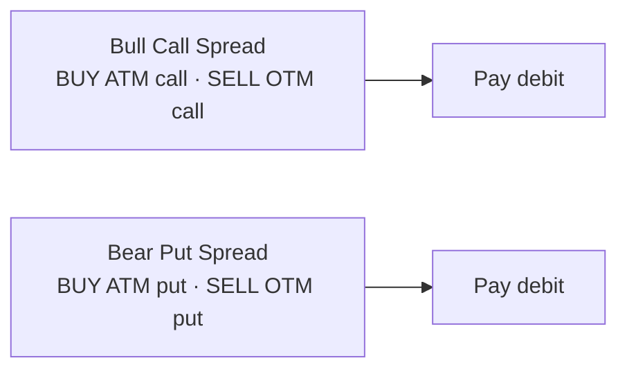
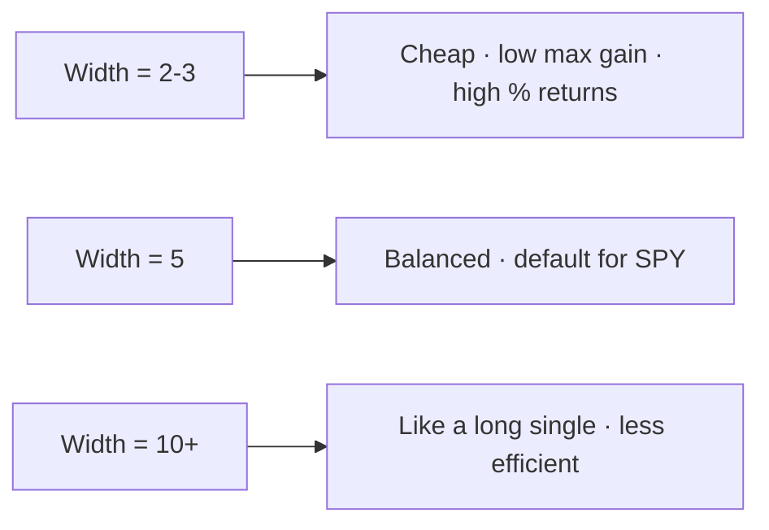

# Vertical Spread

> [!abstract] What it is
> Two legs, same expiration, different strikes. Defined risk, defined reward. The workhorse of options trading.

## The two flavors



## Profit & loss shape

```
Bull Call Spread (debit):

P&L
 |              ___________
 |             /
 |            /
 |___________/______________ price
 |          K1         K2
 -|         (long)     (short)

Max loss  = debit paid
Max gain  = (K2 - K1) - debit
Breakeven = K1 + debit
```

## Construction

| Leg | Type | Side | Strike (bull) | Strike (bear) |
|-----|------|------|---------------|---------------|
| 1 | call (bull) / put (bear) | LONG | nearest ATM | nearest ATM |
| 2 | call (bull) / put (bear) | SHORT | ATM + `strike_width` (bull) | ATM − `strike_width` (bear) |

`strike_width` defaults to **5** points on SPY.

## Why use it

| Benefit | Why |
|---------|-----|
| **Defined risk** | Max loss = debit. Easy to size. |
| **Cheaper than long call** | The short leg subsidizes the long leg |
| **Theta decay smaller** | Two legs partially offset |
| **Easy to model** | Closed-form Black-Scholes is clean |

## Trade-offs

| Cost | Why |
|------|-----|
| **Capped upside** | You give up gains beyond K2 |
| **Two commissions** | Twice as much friction as a single leg |
| **Width = volatility tolerance** | Too narrow = too cheap to be meaningful |

## Tuning the width



## When the engine uses it

`vertical_spread` is the **default** topology in most presets. It's the only topology fully wired into live IBKR execution today.

## Live order structure

In TWS, a vertical spread is a **BAG combo**:

```
ComboLegs:
  - SPY 20260516 C00510 BUY 1
  - SPY 20260516 C00515 SELL 1
LimitPrice = midpoint
```

The combo fills as a single unit — both legs or neither.

## Example values

> [!example] Bull call spread, SPY at $510, 14 DTE
> - Long 510 call: theoretical price ≈ $5.20
> - Short 515 call: theoretical price ≈ $2.80
> - **Net debit** = $2.40 per share = $240 per contract
> - **Max loss** = $240
> - **Max gain** = ($515 − $510) × 100 − $240 = $260
> - **Breakeven** = $510 + $2.40 = $512.40
> - **Risk:reward** ≈ 1:1.08

## Common misuse

> [!warning] Don't go too far OTM
> A 510/520 spread when SPY is at 500 needs SPY to rally hard *and* fast. Far-OTM verticals look cheap but expire worthless most of the time. Stick to **ATM long leg** for higher hit rates.

---

Next: [[Long Call and Put]] · [[Iron Condor]]
