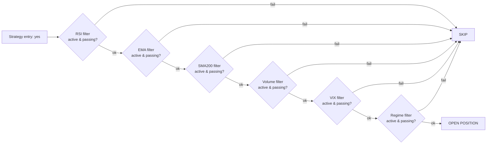
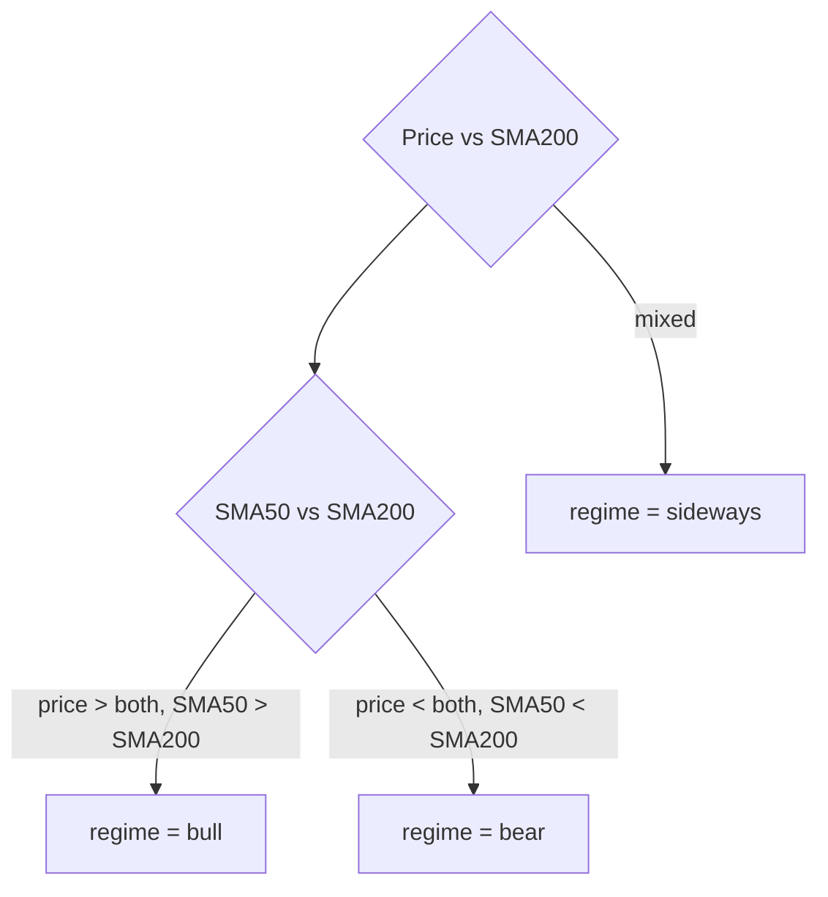

# Entry Filters

> [!abstract] What they are
> Optional **vetoes** that run after a strategy's `check_entry` says "yes." If any active filter fails, the trade is skipped. The exact same filters run in the backtester, the live scanner, and the auto-execute loop — that's the *parity* promise.

## The filter pipeline

## The six filters

### RSI

| Field | Description |
|-------|-------------|
| `use_rsi_filter` | Bool — turn on/off |
| `rsi_threshold` | Number — e.g. 30 |
| Direction-aware? | Yes — bull: RSI < threshold · bear: RSI > 100 − threshold |

> [!example] Mean-reverting bull
> `rsi_threshold = 30` → only enter long when RSI < 30 (oversold).

### EMA

| Field | Description |
|-------|-------------|
| `use_ema_filter` | Bool |
| `ema_length` | Number — e.g. 21 |
| Direction-aware? | Yes — bull: price > EMA · bear: price < EMA |

> [!example] Trend confirmation
> `ema_length = 50` → bull entries only when SPY closes above the 50 EMA.

### SMA200

| Field | Description |
|-------|-------------|
| `use_sma200_filter` | Bool |
| Direction-aware? | Yes — bull: price > SMA200 · bear: price < SMA200 |

The classic "long-term trend" filter. SPY above 200 SMA = secular uptrend.

### Volume

| Field | Description |
|-------|-------------|
| `use_volume_filter` | Bool |
| Logic | Today's volume must exceed 20-day MA |

Filters out low-conviction days. Quiet markets often whipsaw.

### VIX band

| Field | Description |
|-------|-------------|
| `use_vix_filter` | Bool |
| `vix_min` | Number — e.g. 12 |
| `vix_max` | Number — e.g. 30 |

> [!example] Low-vol scalper
> `vix_min=10, vix_max=18` → trade only when VIX is calm.

> [!example] Crash plays
> `vix_min=30, vix_max=80` → trade only after a panic spike.

### Regime

| Field | Description |
|-------|-------------|
| `use_regime_filter` | Bool |
| `regime_allowed` | `bull` / `bear` / `sideways` / `all` |

Regime is computed from **SMA50 vs SMA200 vs price** alignment:

## How filters interact

> [!info] AND, not OR
> Every active filter must pass. They're combined with logical AND. If you turn on five filters at once, you'll see *fewer* trades — by design.

## Tuning advice

> [!tip] Start with two filters max
> Begin with **RSI + regime**. Add others only when you see specific failure patterns in the backtest.
>
> Common failure → fix:
>
> | Failure | Add |
> |---------|-----|
> | Catching falling knives | RSI filter |
> | Trading against trend | SMA200 + regime filters |
> | Whipsaws on quiet days | Volume filter |
> | Pre-event blow-ups | VIX filter |

## Filter parity

> [!success] Same code, same results
> The filter logic lives in `core/filters.py` and is imported by:
>
> - The backtest engine in `main.py`
> - The scanner cron job in `core/scanner.py`
> - The Paper / Live auto-execute path
>
> If a filter fails in your backtest at 14:00 on day X, it would fail at 14:00 on day X live too.

---

Next: [[Risk Mode]] · [[Backtest Mode]]
