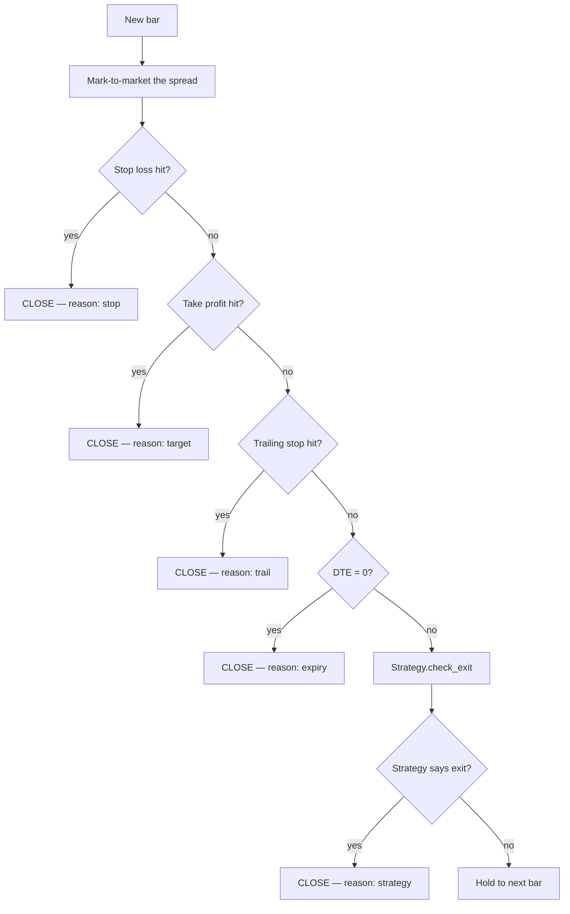
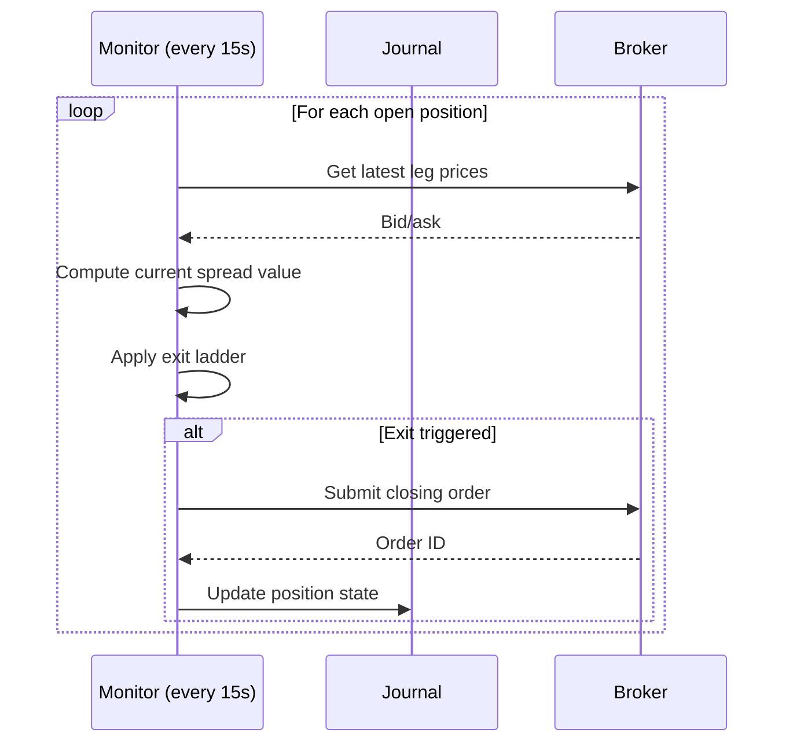

# Exit Controls

> [!abstract] What they are
> The **universal** exit rules every strategy inherits. Whatever your `check_exit` says, these triggers can also close a trade.

## The exit ladder

## The five universal exits

### 1. Stop Loss

| Field | Default | Description |
|-------|---------|-------------|
| `stop_loss_pct` | 50 | % of cost basis — once unrealized loss hits this %, close |

> [!example] Stop loss math
> Entry debit: $200. `stop_loss_pct = 50` → close when current spread value ≤ $100.

### 2. Take Profit

| Field | Default | Description |
|-------|---------|-------------|
| `take_profit_pct` | 50 | % gain → close. Set to 0 to disable. |

> [!example] Take profit math
> Entry debit: $200. `take_profit_pct = 50` → close when current spread value ≥ $300.

### 3. Trailing Stop

| Field | Default | Description |
|-------|---------|-------------|
| `trailing_stop_pct` | 0 (off) | % drawdown from peak unrealized value |

> [!example] Trail dynamics
> Entry: $200. Peak hits $350. `trailing_stop_pct = 30` → close when value falls to 350 × (1 − 0.30) = $245.

### 4. DTE Expiry

| Field | Description |
|-------|-------------|
| `target_dte` | Days-to-expiry at entry. Engine forces exit when DTE = 0. |

This is non-negotiable — you can't hold past expiry without a roll.

### 5. Strategy-specific

Each strategy can return `(True, reason)` from `check_exit`. Examples:

- **Consecutive Days** → exit after `exit_green_days` consecutive green candles
- **Combo Spread** → exit after `combo_max_bars` bars or `combo_max_profit_closes` profitable bars

## How they combine

> [!warning] First trigger wins
> Exits are checked in the order shown above. The *first* trigger that fires closes the trade. The remaining triggers don't get a chance — by design.

## Tuning matrix

| Setting | Tighter | Looser |
|---------|---------|--------|
| `stop_loss_pct` | 30 | 70 |
| `take_profit_pct` | 30 | 80 |
| `trailing_stop_pct` | 20 | 0 (off) |
| `target_dte` | 7 | 30 |

> [!tip] Symmetry isn't always right
> A 50/50 stop/target sounds balanced but assumes 50/50 odds. If your strategy has a 65% win rate, you can run a tighter stop and looser target without hurting equity.

## Reading exit reasons

The journal records the trigger as a string:

| Reason | What it means |
|--------|---------------|
| `stop` | Stop loss triggered |
| `target` | Take profit triggered |
| `trail` | Trailing stop triggered |
| `expiry` | DTE reached zero |
| `mean_reverted` (or other) | Strategy-specific exit |

Patterns to watch for:

- **Most exits = `expiry`** → Your DTE is too long, or your strategy isn't producing real movement.
- **Most exits = `stop`** → Stop is too tight, or filters are too loose.
- **Most exits = `target`** → Healthy. But check if you'd have made *more* by raising the target.
- **Most exits = `trail`** → Trail is doing its job protecting open profit.

## Exit parity in live mode

> [!success] Same exits live
> The `core/monitor.py` tick loop runs every `MONITOR_INTERVAL_SECONDS` (default 15 s) on **live** positions and applies the same exit ladder. Closures are submitted to the broker as marketable limit orders.

---

Next: [[Risk Mode]] · [[Entry Filters]]
