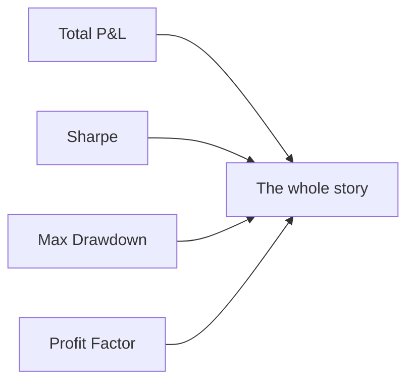
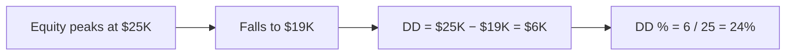
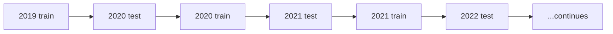

# Metrics Explained

> [!abstract] What you'll learn
> Every backtest produces 14 numbers. This page tells you what each one means, why it matters, and what "good" looks like.

## Headline numbers

| Metric | What it answers | "Good" looks like |
|--------|-----------------|-------------------|
| **Total P&L** | Did I make money? | Positive after commissions |
| **Win Rate** | What % of trades won? | Context-dependent |
| **Sharpe Ratio** | Was the return worth the risk? | > 1.0 decent, > 2.0 rare |
| **Sortino Ratio** | Downside-adjusted Sharpe | > 1.5 healthy |
| **Max Drawdown** | Worst peak-to-trough? | "Can I stomach this?" |
| **Profit Factor** | Wins ÷ losses | > 1.5 good, < 1.0 broken |
| **Kelly %** | Theoretical optimal size | Use ~½ of this in real life |
| **Recovery Factor** | P&L ÷ max DD | > 3 healthy |
| **Avg Win** | Average $ on a winning trade | Should beat avg loss |
| **Avg Loss** | Average $ on a losing trade | Lower abs value than avg win |
| **Max Consecutive Losses** | Longest losing streak | Plan for 2× this |
| **Avg Hold Days** | Average trade duration | Match to your DTE |
| **Final Equity** | Starting capital + P&L | Compare to buy-and-hold |

## The big four



If these four agree the strategy is healthy, you have something. If even one of them is bad, you don't.

## Win rate ≠ profitability

> [!warning] The classic trap
> A 70% win rate sounds great, but if your average win is $50 and your average loss is $200, you lose money:
>
> 70 × $50 − 30 × $200 = $3,500 − $6,000 = **−$2,500**
>
> Always read **Profit Factor** and **Avg Win / Avg Loss** alongside Win Rate.

## Sharpe and Sortino

```
Sharpe  = (avg return − risk-free) / std dev of returns
Sortino = (avg return − risk-free) / std dev of NEGATIVE returns only
```

**Sortino is usually higher** because it ignores upside variance. A strategy with big wins and small losses will have an excellent Sortino but a mediocre Sharpe.

## Max Drawdown — the gut check



> [!warning] Live drawdowns feel 2× backtest drawdowns
> A 20% DD on paper is bearable. Watching it happen with real money is brutal. Multiply backtest DD by **2** to estimate the emotional cost of live trading.

## Profit Factor

```
Profit Factor = sum(gross wins) / sum(gross losses)
```

| PF | Read |
|----|------|
| < 1.0 | Strategy loses money |
| 1.0 – 1.5 | Marginal — fragile to slippage |
| 1.5 – 2.5 | Healthy |
| > 2.5 | Suspicious — check for overfitting |

## Kelly %

> [!info] The size formula
> ```
> f* = W − (1 − W) / R
> ```
> where W = win rate, R = avg win / avg loss

Tells you the *theoretical* optimal fraction of equity per trade. **Always use less** — Kelly assumes infinite trials, no slippage, and known probabilities. Real markets don't.

> [!example] Kelly math
> Win rate 60%, R = 1.5: f* = 0.60 − 0.40/1.5 = 0.60 − 0.267 = **33%**.
> In practice, traders use 25-50% of Kelly → real bet size **8-16%**.

## Recovery Factor

```
Recovery Factor = Total P&L / Max Dollar Drawdown
```

How much did you make for every dollar of pain? > 3 means a strategy that's worth the risk.

## Monte Carlo

> [!info] Why simulate?
> Backtests are *one* sequence. Markets could have given you any reordering of those trades. Monte Carlo resamples the trades 1,000 times to show the *distribution* of possible outcomes.

Outputs:

| Field | Meaning |
|-------|---------|
| **P5** | 5% of resamples did worse than this |
| **P50** | Median outcome |
| **P95** | Top 5% outcome |
| **Probability of Profit** | % of resamples that ended positive |

> [!warning] If P5 is severely negative...
> ...your strategy has a fat-left-tail. One bad streak can wipe you out.

## Walk-forward



Trains on a rolling window, tests on the next window. If P&L stays positive across the rolling out-of-sample windows, the strategy generalizes. If it only worked in 2020, walk-forward will expose it.

## Regime breakdown

Trades / win rate / P&L grouped by market regime:

| Regime | What |
|--------|------|
| `bull` | SMA50 > SMA200, price > both |
| `bear` | SMA50 < SMA200, price < both |
| `sideways` | Mixed alignment |

> [!tip] Regime breakdown is the most underrated tab
> Many strategies look great overall but lose money in one regime. The fix isn't always to discard the strategy — sometimes it's to **add a regime filter** so you only trade in the regimes where it works.

## Reading metrics together

| Pattern | Diagnosis |
|---------|-----------|
| High win rate, low PF | Avg loss > avg win — your stops are too wide |
| High PF, low win rate | Few big winners — rides trends well |
| High Sharpe, low Sortino | Unusual — check the data |
| Big P&L, big DD | Volatile — size down |
| Small P&L, small DD | Boring but steady — size up cautiously |
| 100% bull regime profit | Add regime filter, accept fewer trades |

---

Next: [[Backtest Mode]] · [[Building Your Own]]
