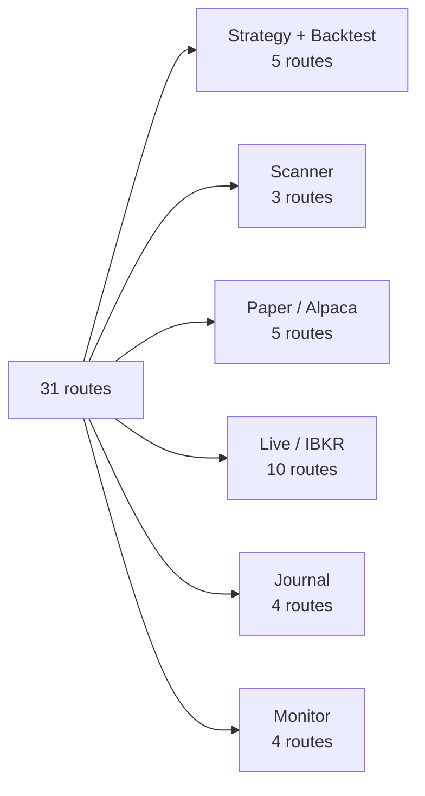
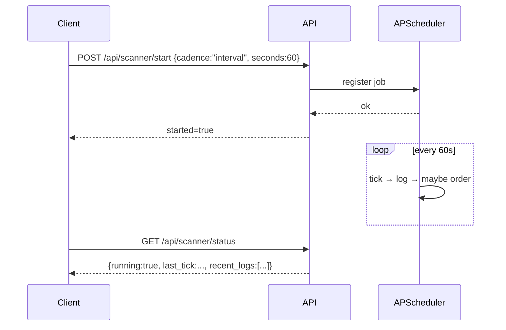
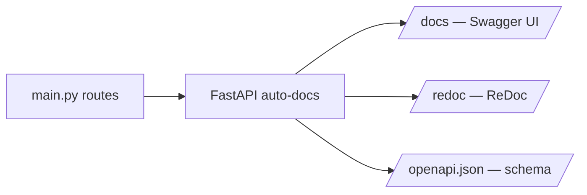

# REST Endpoints

> [!abstract] Where to find them
> All endpoints live at `http://127.0.0.1:8000`. Live Swagger UI at `/docs`. There are 31 routes total.

## Quick map



---

## Strategy & Backtest

| Method | Path | What |
|--------|------|------|
| GET | `/api/strategies` | List registered strategy plugins |
| POST | `/api/backtest` | Run backtest → trades, metrics, equity curve, analytics |
| POST | `/api/optimize` | Grid search two parameters → ranked results |
| GET | `/api/spy/intraday` | SPY intraday sparkline data |
| GET | `/api/live_chain` | Live options chain via yfinance |

> [!example] Run a backtest
> ```bash
> curl -X POST http://127.0.0.1:8000/api/backtest \
>   -H "Content-Type: application/json" \
>   -d '{
>     "strategy": "consecutive_days",
>     "topology": "vertical_spread",
>     "direction": "bull",
>     "entry_red_days": 3,
>     "exit_green_days": 1,
>     "target_dte": 14,
>     "stop_loss_pct": 50,
>     "take_profit_pct": 50,
>     "start": "2024-01-01",
>     "end": "2025-12-31"
>   }'
> ```

---

## Scanner

| Method | Path | What |
|--------|------|------|
| POST | `/api/scanner/start` | Start the cron job |
| POST | `/api/scanner/stop` | Stop the cron job |
| GET | `/api/scanner/status` | Status + recent logs |



---

## Paper Trading (Alpaca)

| Method | Path | What |
|--------|------|------|
| POST | `/api/paper/connect` | Connect + return account info |
| POST | `/api/paper/positions` | Open Alpaca positions |
| POST | `/api/paper/orders` | Recent Alpaca orders |
| POST | `/api/paper/execute` | Place equity order (buy/sell) |
| POST | `/api/paper/scan` | Run signal scan on live data |

> [!info] Why POST for reads?
> Credentials live in the request body. POST keeps them out of URL logs.

---

## Live Trading (IBKR TWS)

| Method | Path | What |
|--------|------|------|
| POST | `/api/ibkr/connect` | Connect + account summary |
| POST | `/api/ibkr/heartbeat` | Health check — alive, alerts, scheduler |
| POST | `/api/ibkr/reconnect` | Force reconnect |
| POST | `/api/ibkr/positions` | IBKR portfolio |
| POST | `/api/ibkr/execute` | Place multi-leg combo order |
| POST | `/api/ibkr/test_order` | Non-filling test order at $1.05 |
| GET | `/api/ibkr/orders` | Open TWS orders |
| POST | `/api/ibkr/cancel` | Cancel order by ID |
| POST | `/api/ibkr/flatten_all` | Kill switch — close everything |
| POST | `/api/ibkr/chain_debug` | Step-by-step chain resolution |

> [!example] Submit a vertical spread
> ```bash
> curl -X POST http://127.0.0.1:8000/api/ibkr/execute \
>   -H "Content-Type: application/json" \
>   -d '{
>     "creds": {"host":"127.0.0.1","port":7497,"client_id":1},
>     "spread": {
>       "topology": "vertical_spread",
>       "direction": "bull",
>       "target_dte": 14,
>       "strike_width": 5,
>       "contracts": 1
>     }
>   }'
> ```

---

## Journal

| Method | Path | What |
|--------|------|------|
| GET | `/api/journal/positions` | List open or all positions |
| GET | `/api/journal/daily_pnl` | Today + N-day rolling P&L |
| GET | `/api/journal/events` | Audit trail event stream |
| GET | `/api/journal/reconciliation` | Backtest ↔ live parity report |

---

## Monitor & Notify

| Method | Path | What |
|--------|------|------|
| POST | `/api/monitor/start` | Register monitor + fill watcher |
| POST | `/api/monitor/stop` | Unregister scheduler jobs |
| POST | `/api/monitor/paper_entry` | Dry-run forced entry (test) |
| POST | `/api/notify/digest` | Manual trigger for daily digest webhook |

---

## Auth & errors

> [!info] No auth
> The server runs on localhost only by default. There's no auth layer. Don't expose it to the public internet without a proxy + auth.

> [!warning] Error shape
> Errors return `{"detail": "<reason>"}` with a `4xx` status code. Common reasons:
> - `risk gate blocked: max concurrent positions`
> - `IBKR not connected`
> - `Alpaca credentials missing`
> - `unknown strategy`

## Rate limiting

> [!info] None today
> `/api/backtest` and `/api/optimize` are CPU-intensive but uncapped. If you expose to multiple users, add `slowapi` (in the roadmap).

## Generated docs



Visit `/docs` for an interactive UI you can call endpoints from.

---

Next: [[System Architecture]] · [[Glossary]]
